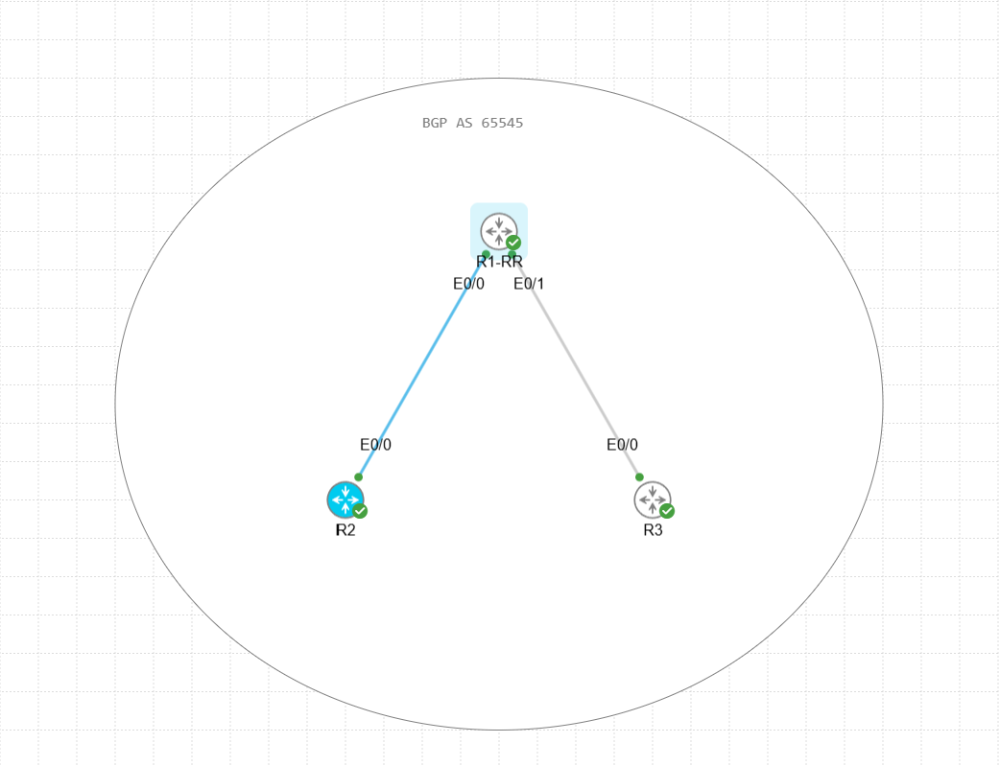
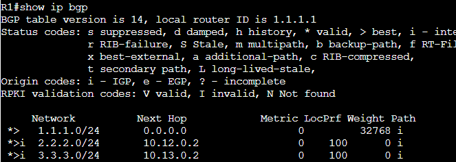
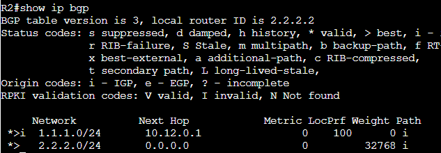
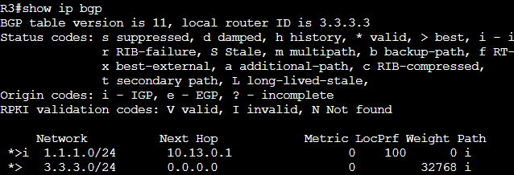
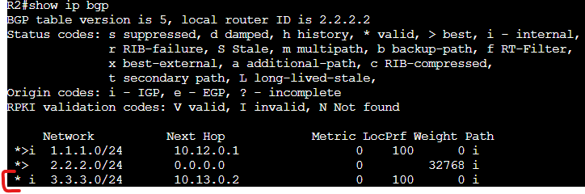
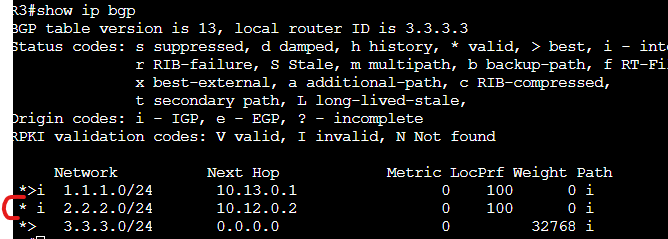
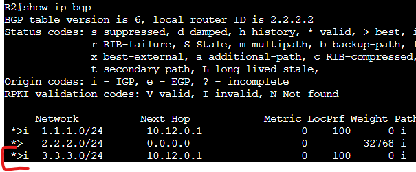
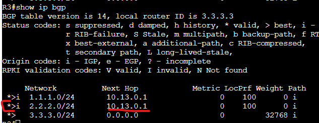
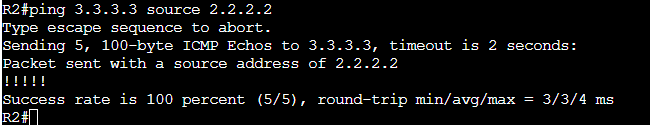

# IBGP-RR LAB

In this Lab we are displaying the use case for RR within the same AS (IBGP Peers) to avoid having to create a full mesh IBGP neighbor configuration.

The reason Route Reflection is required is because IBGP neighborships do not propagate other IBGP received routes to IBGP peers.

Assets in the Lab:

R1,R2,R3 

We are going to connect R1, R2 and R3 in the following topology.

- The Networks used will be 10.X.0.0/24. X will be the combined number of the router numbers. R1,R2 = 10.12.0.0/24 etc. 
- We will also have a loopback on each router based on their router number that we will be advertising over BGP Ex: R1 = 1.1.1.1.

R1 = 10.12.0.1, 10.13.0.1  
R2 = 10.12.0.2  
R3 = 10.13.0.2  

Let's start with making a basic IBGP peer between R1 and R2.

R1:
conf t  
router bgp 65545  
neighbor 10.12.0.2 remote-as 65545  
neighbor 10.12.0.2 activate  
address-family ipv4 unicast  
network 1.1.1.0 mask 255.255.255.0  

R2:
conf t  
router bgp 65545  
neighbor 10.12.0.1 remote-as 65545  
neighbor 10.12.0.1 activate  
address-family ipv4 unicast  
network 2.2.2.0 mask 255.255.255.0  

Follow these same steps on R1 to R3.

After this is completed the BGP tables will populate. Here will be the results from each router.

As you can see the loopbacks advertise from R2 and R3 into R1 but R1 does not re-advertise these routes to other IBGP neighbors so R2 and R3 are missing each others loopback networks.

To resolve this route propagation issue we will enable Route-Reflection.

R1:
conf t  
router bgp 65545  
address-family ipv4 unicast  
neighbor 10.12.0.2 route-reflector-client  
neighbor 10.13.0.2 route-reflector-client  

Now lets take a look at the routing table on R2 and R3.

We can see the route is now in the BGP table but is not being installed into the routing table. This is due to the next hop being the peer address of R2 and R3 respectively. R2 and R3 don't know how to get to each other so how do we resolve this?

The solution in this hub and spoke topology is to enable next-hop-self from the hub router (R1) so that the next hop is in a network that can be reached from those spoke routers.

R1: 
conf t  
router bgp 65545  
address-family ipv4 unicast  
neighbor 10.12.0.2 next-hop-self all  
neighbor 10.13.0.2 next-hop-self all  

(The "all" notation in the next-hop-self command is very important here. This indicates that it will apply to both EBGP routes and IBGP routes. If you do not select all in the command it will only apply to EBGP routes.)

Now that this is applies lets look at the final version of the routing table.

We can see that the routes are now installed and the next hops are showing to be the R1 router neighbor. Let's test a ping.

Success.