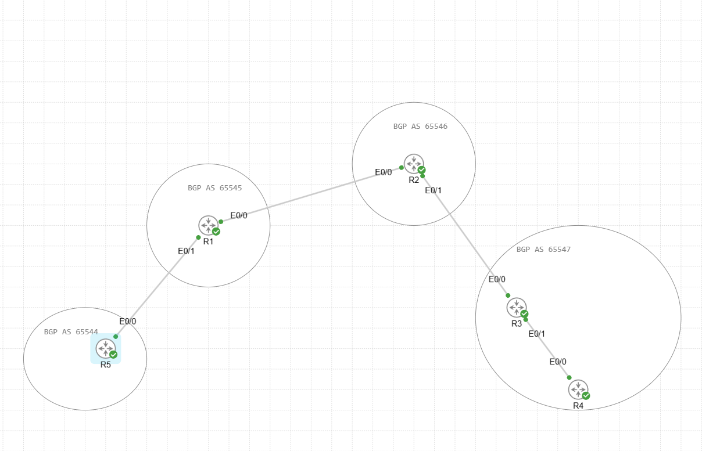
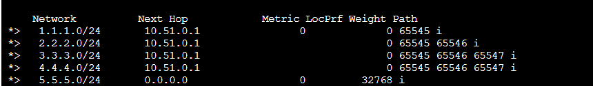
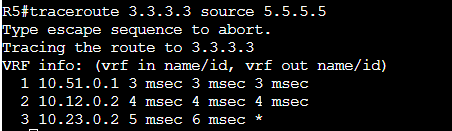
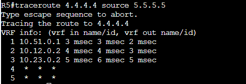
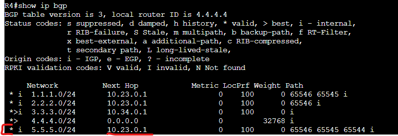
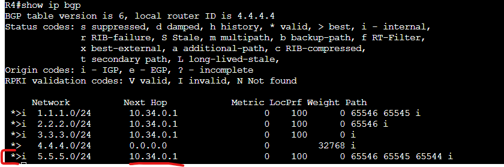

# EBGP LAB

In this Lab we are creating a 5 router EBGP peering network. This has a total of 4 AS's with one containing an IBGP peer.

Assets in the Lab:

R1,R2,R3,R4,R5

We are going to connect R1,R2,R3,R4 and R5 in the following topology.

- The Networks used will be 10.X.0.0/24. X will be the combined number of the router numbers. R1,R2 = 10.12.0.0/24 etc.
- We will also have a loopback on each router based on their router number that we will be advertising over BGP Ex: R1 = 1.1.1.1.

R1 = 10.12.0.1, 10.51.0.1  
R2 = 10.12.0.2, 10.23.0.1  
R3 = 10.23.0.2, 10.34.0.1  
R4 = 10.34.0.2  
R5 = 10.51.0.2  

To cut down on the length of the document I will not be documenting all configuration for all peers. Lets start with R5 to R1 and the rest of the routers follow suit.

R5:  
router bgp 65544  
neighbor 10.51.0.1 remote-as 65545  
neighbor 10.51.0.1 activate  
address-family ipv4 unicast  
network 5.5.5.0 mask 255.255.255.0  

R1:  
router bgp 65545  
neighbor 10.51.0.2 remote-as 65545  
neighbor 10.51.0.2 activate  
address-family ipv4 unicast  
network 1.1.1.0 mask 255.255.255.0  

These same steps apply for all other routers in the topology just with different remote-as numbers.

Once all the neighbors are online lets take a look at the far most router R5's BGP table.

As we can see all the loopback interfaces are being received by the R5 router through its R1 neighbor. Since that neighbor is alive all these routes are valid and installed in the routing table.

One key thing to observe in this BGP table is the Path defined for each network. Here we can see which AS each received network has had to pass through. For example the R1 loopback came from only AS 65545 but R3 loopback had to travel through R2's AS (65546) as well as R1's AS (65545) adding both AS's as well as its own into the path.

AS Path length is an important metric to keep note of as this is one of the important metrics used in the routers best path selection.

Let's try a trace across the network. Lets start with R5 to R3.

The flow as expected is through R1 followed by R2 onto R3 inbound interface over the R2 peer network.

Let's now try a ping to the R4 router which is under the same AS as R3.

As we can see the traceroute fails after the R3 router. Let's have a look on R4 and see why.

If you look closely the Route from R5 is received but is not installed in the routing table. As you can see the next hop is defined as 10.23.0.1 which is a network connected to R3 and not R4. Since the next hop is not available the route is not installed.

There are two solutions to this:  

1: Since R3 is the only exit to the internet we can install a default route pointing to the next hop of R3.  
2: Alternatively using BGP we can have R3 use the next-hop-self command to ensure that all advertised routes down to R4 advertise itself as the next hop. 

Let's go with option 2 as if we wanted to use the static default route on R4 then we could have skipped setting up the BGP peer to R3 all together.

On Router R3 run the following change.

R3:  
conf t  
router bgp 65547  
address-family ipv4 unicast  
neighbor 10.34.0.2 next-hop-self all  

Exit then run a bgp clear (clear ip bgp * soft

Now we look at R4's routing table once more.

5.5.5.5 is now available and installed in the routing table as the next hop for all upstream routes have changed to R3's neighbor IP.

Let's run another ping.

Success.

