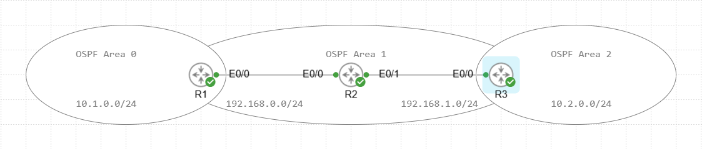
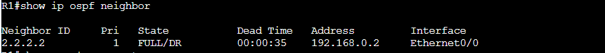
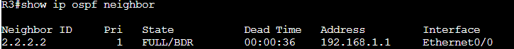
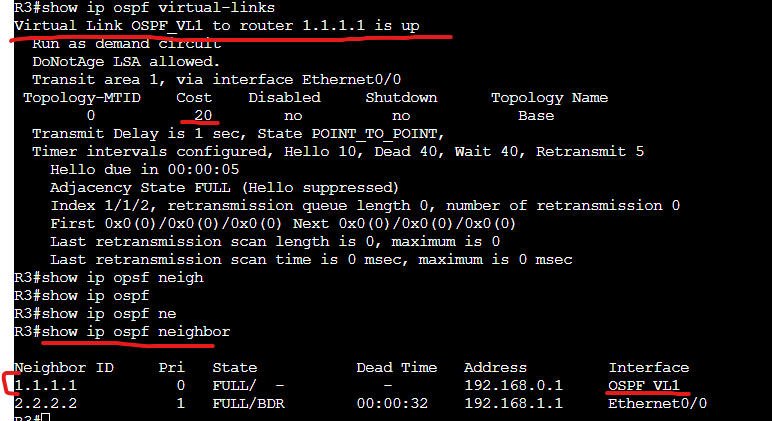
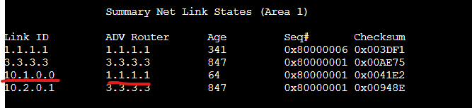
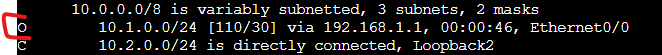
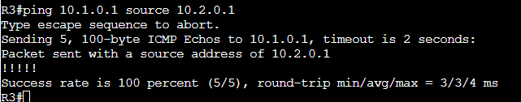

# OSPF Virtual-Link Lab

In this Lab we will be configuring OSPF Virtual-Link to enable an OSPF area that is not directly connected to the backbone area to form a neighbor with the backbone area over another router. This could also be used to enable a backup path within OSPF but in our topology there is only a single path between the two routers.

Assets in the topology:

R1,R2,R3

- The Networks used will be 192.168.0.0/24 between R1 and R2. Between R2 and R3 will be 192.168.1.0/24. There will also a 10 network one within area 0 and another in Area 2 which will be what we are trying to connect over the virtual link.
- We will also have a loopback on each router based on their router number that will be used as their router-ID. EX: R1= 1.1.1.1

First lets configure Area 0 and Area 1 between R1 and R2. Then Area 1 and Area 2 on R3.

R1:  
conf t  
router ospf 1  
network 1.1.1.0 0.0.0.255 area 0  
network 192.168.0.0 0.0.0.255 area 1  
network 10.1.0.0 0.0.0.255 area 0  

R2:  
conf t  
router ospf 1  
network 2.2.2.0 0.0.0.255 area 1  
network 192.168.0.0 0.0.0.255 area 1  
network 192.168.1.0 0.0.0.255 area 1

R3:  
conf t  
router ospf 1  
network 3.3.3.0 0.0.0.255 area 2   
network 192.168.1.0 0.0.0.255 area 1
network 10.1.0.0 0.0.0.255 area 2  

Let's check the neighborship status.

Neighbors are formed in each area to R2 but R1 does not have a neighborship formed to R3 so area 2 has no way to talk back to the network in area 0. Lets establish that neighborship through OSPF Virtual-Link so that R3 which connects to Area 2 can have a connection to the backbone Area.

We run the following commands on R1 to define the neighbor it will be connecting to through Virtual-Link as well as what area is going to be the transit area for the virtual link. In this case, its area 1. You also want to ensure that the IP you are defining is the Router ID on the neighboring router.

R1:  
conf t  
router ospf 1  
area 1 virtual-link 3.3.3.3

We then run the following commands on R3.

R3:  
conf t  
router ospf 1  
area 1 virtual-link 1.1.1.1 

Right away we can see neighbors establish.

Let's now check the neighbor tables.

We can see the Virtual link ID of VL1 is used on R3, then following that checking the OSPF neighbors you can now see 1.1.1.1 is a neighbor. Important things to note from this show command are the cost as well as see how the network type is a Point to point network type.

Let's check the ospf database and Routing table.

We can see here in the OSPF database of R3 there is a LSA type 3 entry in area 1 for the 10.1.0.0 network coming from router ID 1.1.1.1.

Next we check the routing table.

Here we see the route for the 10.1.0.0/24 network with the next hop of R1 which is available over the Virtual link.

Let's test with a ping.

Success.