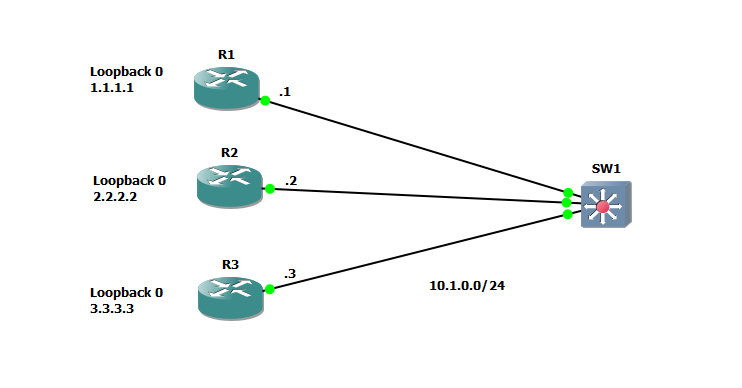
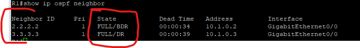
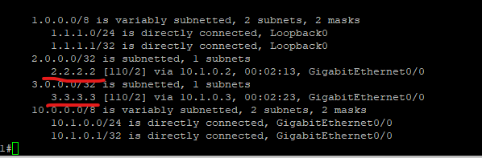
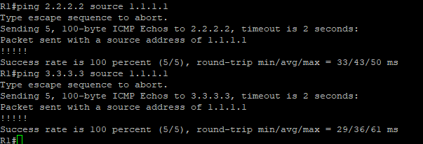
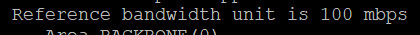
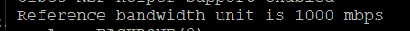
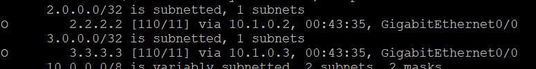
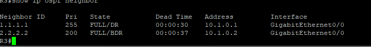

# Single-Area OSPF Lab

In this lab we are creating a single area (area 0) OSPF neighborship. This is as simple as can be for an OSPF area as there are only LSA's type 1 and 2 within the area with no ABR's or ASBR's involed.

Assets in this Lab:  

R1,R2,R3

Here is the topology used.

We will be using the 10.1.0.0/24 network and each router will have one interface connected into this network to form neighborships.

On each router will we configure the following to create the single area OSPF.

R1:  
conf t  
router ospf 1  
network 1.1.1.0 0.0.0.255 area 0  
network 10.1.0.0 0.0.0.255 area 0  

R2:  
conf t  
router ospf 1  
network 2.2.2.0 0.0.0.255 area 0  
network 10.1.0.0 0.0.0.255 area 0 

R3:  
conf t  
router ospf 1  
network 3.3.3.0 0.0.0.255 area 0  
network 10.1.0.0 0.0.0.255 area 0 

This will bring up the OSPF process on each router and advertise the loopback as well as both interfaces that are within the 10.1.0.X address space.

Alternatively you can use the "network 0.0.0.0 0.0.0.0 area 0" statement to include all interfaces into OSPF including the loopback interface.

Let's look at the neighbors formed.

On R1 we can see its neighboring with R2 and R3 with their respective Router-ID in this case its their loopbacks as we didnt define a router-ID explicitly.

Let's now look at the routing table and see if the neigboring routes are available and reachable.

Both 2.2.2.2 and 3.3.3.3 are in the routing table.

It is also reachable from R1.

# OSPF Reference-Bandwidth

If you look closely at the Routing table we can see the cost metric beside the AD. This Metric has been determined to be 2 as OSPF uses the reference bandwidth divided by the Interface bandwidth to find the cost.

By default this reference bandwidth it 100 mbps when you create the OSPF process. This can be problematic if there is both Fast ethernet and Gigabit ethernet interfaces in the environment, they will be equal costs! When they are definitely not equal in throughput.

To change this we will run the following on all routers.

R1:  
conf t  
router ospf 1  
auto-cost Reference-bandwidth 1000  

If you look now the reference bandwidth is now 1000mbps or 1G. If you have a Fast ethernet link it will now be a cost of 10.

As a demo I have turned R1's interface into a Fast ethernet link. Take a look at the metric for the routes.

You can now see that the metric is 11 (10 + 1 for the interface attached to the other routers)

Now that reference bandwidth is resolved there is one more important change that should be done within the area.

# Influencing the DR/BDR Election

Due to this being a broadcast network type a DR and BDR router will be elected. By default it goes by highest priority, then loopback IP, then highest interface IP. Since R3 has the highest loopback it is the DR for the segment. R2 is the BDR.

On the other hand its possible R1 is meant to be the DR for the segment as its the highest model with the most resources. How can we influence this election?

Let's influence the DR election to make R1 the DR for the segment as its neither DR or BDR at the moment.

On R1 run the following commands:

R1:  
conf t  
interface gi0/0  
ip ospf priority 255

Then I set a priority of 200 on R2 to show the priority effect a second time as normally R3 would be the BDR as it has the highest loopback but in this example R2 should be the BDR

This is best displayed from R3. If you look at the neighbor table you can see R1 is the DR with a pri of 255 and R2 is the BDR with a priority of 200. DR and BDR has no effect on routing decisions but helps to reduce broadcasts of LSA type 2's inside of a broadcast network type. Only the DR advertises the Type 2 LSA's to the network segment reducing overhead from all the routers speaking on the network individually.

