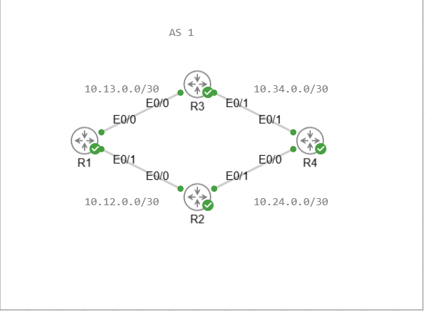
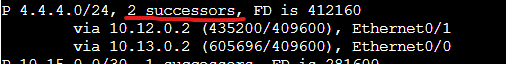
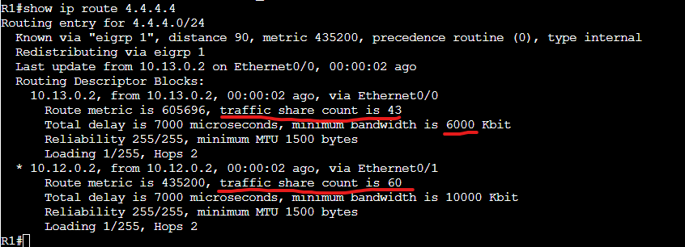
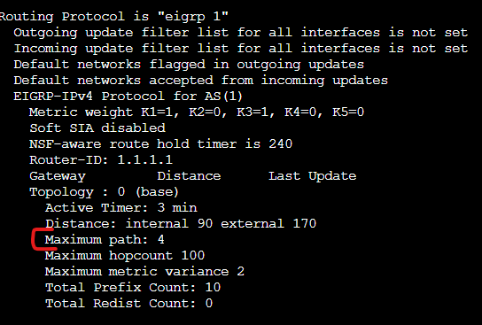

# Unequal cost load balancing

We will build upon our last lab and display un-equal cost load balancing through EIGRP. 

As it says can be used to load balance traffic between multiple successor routes. By default there is a variance metric in EIGRP to determine what routes can be used for unequal cost load balancing. It is set to 1 by default which means unless we had 2 successor routes with the same feasible distance (just like ECMP routes) it would not select a feasible successor route to load balance.

Here is the Topology we will use.

Next we will enable un-equal cost multipathing by setting the variance to a multiplier more than 1. In this case we will set the variance to 2 as the metrics between both routes will not exceed twice the Feasible distance of the successor route.

Additionally I have increased the unequality between the two routes of R2 and R3 to help display the unequal cost multipathing better.

R1:

conf t  
router eigrp 1  
variance 2

Let's check the eigrp Topology

We can see now that both routes are successor routes but how is the traffic divide up between the two? Let's run the calculations.

First we will run a show ip route 4.4.4.4 to see the traffic share count values for each route.

For each 60 packets that go over the R2 route 43 will go over the R3 route. To help quantify this better let's turn this into percentages.

First add both traffic share counts together to get 103.

Next we first divide 60 by 103 to get .582 this means about 58% of traffic will go over R2's link. 43 divided by 103 is .417 so 42% of traffic will go over R3's link.

Unequal cost load balancing doesn't have to be just between two interfaces there can be up to 4 paths by default. This can be seen by running a show ip protocols.

