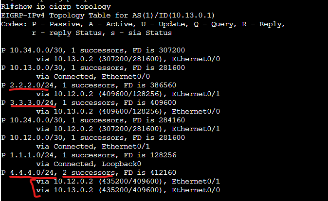
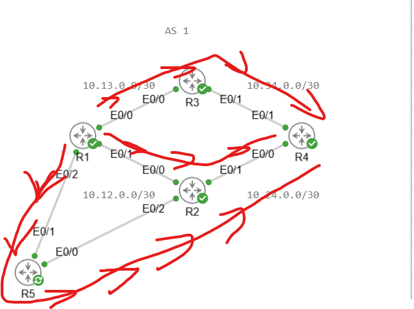

# General EIGRP Lab

In this lab we will be configuring 4 routers in a single EIGRP AS to display since route advertisement, metrics, successor routes and the feasibility condition.

Assets in the lab:

R1,R2,R3,R4

Topology in this lab:

Let's configure the 4 routers into the EIGRP instance. To accomplish this you use the same network level commands as OSPF.

R1-R4:

conf t  
router eigrp 1  
network 0.0.0.0 255.255.255.255  

For simplicity sake we used a blanket Network statement which encompasses all interfaces on the routers to participate in EIGRP.

Let's take a look at the EIGRP topology table now that the neighbors are formed. 

As we can see the neighbors are formed and the EIGRP topology table is populated with routes. If we focus into R4 which is across the network from R1 we can see 2 routes. 1 through R3 and another through R2. Since the feasible distance of both routes are the same they are considered ECMP routes and will do load balancing across both links.

Let's adjust the delay on the downstream link between R2 and R4 and see how this affects the Advertised distance and feasible distance of the route.

As we can see after reducing the delay on the link between R2 and R4 we can see the Advertised Distance has changed to 407040 from the original 409600.

# Feasibility condition

Next let's talk about the Feasibility condition and what it achieves as well as calculating the successor and feasible successor routes.

The feasibility condition is a loop prevention mechanism to eliminate routing loops or have a feasible successor (backup route) that goes through the successor router that is currently down.

The feasibility condition reads that a feasible successor must have an advertised distance lower than the feasible distance of the successor route for it to meet the feasibility condition. This concept takes real hands on practice to understand properly.

We will create an example of this by introducing another router into the topology connected to R2.

With R5 connected we now have the following topology.

After R5 has been configured we now have an extra path to flow to the R4 network. Let's check back on R1's EIGRP topology table. (Ensure you use the command show ip eigrp topology all-links or else it will not show routes that don't meet the feasibility condition)

Let's analyze all the available routes. Starting with the Successor route of R2.

10.12.0.2 (432640/407040), Ethernet0/1 - Here we can see the Feasible Distance is 432640 and the Advertised Distance is 407040. 

For our feasibility condition all other routes that want to be feasible successors have to have an advertised distance lower than 432640.

Let's look at the following two routes.

10.15.0.2 (458240/432640), Ethernet0/2  
10.13.0.2 (435200/409600), Ethernet0/0

For the route via R5 (10.15.0.2) the advertised distance is the same as the feasible distance. This is because the R5 router is behind the R2 router so this is an indication that it is flowing through the same router that is connected to R1 to reach R4 so it will not be a feasible succesor.

For the route via R3 (10.13.0.2) the advertised distance is 409600 which is lower than the feasible distance of 432640. This means the route will be a feasible successor and will be an available backup route to fallback to if the primary route fails.