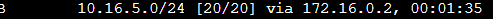
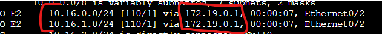

# DC-DR underlay OSPF Design

In this lab I will be demonstrating a DC-DR design concept that interconnects two central datacenters to each other as well as down to a branch network in a hub and spoke topology. These datacenters will connect up to a provider using EBGP which would represent a B2B connection for connected services but could also represent redundant internet providers.

Assets in this lab:  
C-R1, C-R2, A-R1, A-R2, SW1, Branch

Topology for this demonstration:

As we can see from the topology we are going to be connecting 3 different types of routing together. OSPF,BGP as well as some static routes for internal networks. All of these will need to be re-distributed into each other to provide a fully converged network. 

Let's begin with configuring EBGP to the customer R1 and R2 routers first.

# EBGP Configuration

We will only be focusing on the BGP configuration, internal networks are already configured at this stage.

On C-R1 and C-R2 we will establish neighbors with the A-R1 and A-R2 routers.

C-R1:  
router bgp 65550  
network 10.170.0.0 mask 255.255.0.0  
network 10.172.0.0 mask 255.255.0.0  
neighbor 172.16.0.2 remote-as 65540  

C-R2:  
router bgp 65555  
network 10.170.0.0 mask 255.255.0.0  
network 10.172.0.0 mask 255.255.0.0  
neighbor 172.16.0.6 remote-as 65540  

A-R1:  
router bgp 65540  
neighbor 172.16.0.1 remote-as 65550  
neighbor 172.16.0.1 activate  
address-family ipv4 unicast  
network 10.16.0.0 mask 255.255.255.0  
network 10.16.1.0 mask 255.255.255.0  

A-R2:  
router bgp 65540  
bgp log-neighbor-changes  
neighbor 172.16.0.5 remote-as 65555  
neighbor 172.16.0.5 activate 
address-family ipv4 unicast 
network 10.16.3.0 mask 255.255.255.0  
network 10.16.4.0 mask 255.255.255.0  
distance bgp 115 200 200  

On R2 we have set the EBGP route distance to be 115 which we will see how this comes into play later after configuring OSPF on both the DC/DR routers. Let's take a look at the routing tables on the A-R1 router to ensure that the B2B EBGP sourced routes are in the routing table.

As we can see we can see the routes are installed in the routing table and sourced from AS 65550. Same goes for R2 with its EBGP neighbor.

# OSPF Configuration

Let's now dive into the OSPF configuration. We have two main connections the direct from DC/DR which would be represented by an EPL or L2 line between datacenters as well as the switched connection which could represent a branch MPLS connection. This could be done similarily with IPSEC but in those configurations its normally best to work with IBGP.

Due to the complexity let's outline the objectives we want to achieve for the various traffic flows.

-We want DC to advertise a default route to the branch router and DR should also advertise a default route but at a higher cost.  
-Branch to our EBGP routes we want to flow to DC and out. If there is a failure we want it to flow to DR then through the underlay to DC unless EBGP is broken at the DC site to avoid asymetric routing.  
-Branch to DC/DR networks should flow direct over each neighborship and if that neighborship is broken to go direct it would go to the alternative neighbor and through the underlay. Same for reverse traffic flows.  
-DC to DR and vise versa should go direct over the L2 unless that neighborship is down then it will go over the MPLS network.  

First let's start with the basic OSPF configuration.

DC:  
router ospf 1  
router-id 1.1.1.1  
redistribute static metric 1  
network 172.16.0.8 0.0.0.3 area 0  
network 172.19.0.0 0.0.0.255 area 0  
default-information originate always metric 100  

DR:  
router ospf 1  
router-id 2.2.2.2  
redistribute static metric 1  
network 172.16.0.8 0.0.0.3 area 0  
network 172.19.0.0 0.0.0.255 area 0  
default-information originate always metric 200  

Branch:  
router ospf 1  
network 10.16.5.0 0.0.0.255 area 0  
network 172.19.0.0 0.0.0.255 area 0  

At this stage we have completed 3 things. The interconnects between DR/DR/Branch are advertised. The DC/DR static routes are advertised into OSPF and a default route is distributed into OSPF with Type E2 and a static metric of 100 at DC and 200 at DR.

Let's take a look at the branch routing table.

# OSPF Cost adjustments

One of the objectives outlined is that we want to have DC to DR traffic flow through the Underlay primarily and through the MPLS network only upon failure. Since both connections between DC/DR have the same cost these routes are now ECMP.

This is not what we want as it will attempt to load balance traffic over both links. Let's adjust the cost on both R1 and R2 so that the cost associated with egressing the underlay interface is only 5.

A-R1/2:  
int e0/1  
ip ospf cost 5  

Now let's take another look at the routing table.

As we can see it no longer had the MPLS network neighbor route in the routing table indicating that it will primarily send its traffic through the underlay.

Next we need to redistribute routes over BGP as well as into OSPF.

# BGP and OSPF redistribution

We want to advertise the BGP learned networks into OSPF as we cannot rely on the default route alone as this will not reconverge if a failure between DC and the B2B provider occur. If we redistribute the specific routes and a failure occur then DR will advertise the B2B routes while default route traffic can continue to flow through DC.

We will apply these changes on A-R1 and R2.

A-R1:  
router ospf 1  
redistribute bgp 65540 subnets metric 100  

A-R2:  
router ospf 1  
redistribute bgp 65540 subnets metric 200  

Let's take a look at the branch routing table now.

We can see the branch router now has routes to the B2B provider advertised through R1 with a metric of 100. We will display all the failover scenarios at the end of the demo.

Let's also take a look at the DR router as if we remember we set the BGP route AD to be 115 so now that it is receiving the 10.170 and 172 networks from DC through OSPF it should prefer that over its directly connected EBGP routes.

we can see it prefers to send the traffic to DC and this way when we redistribute OSPF into BGP there wont be any asymetrical routing.

(Note): Depending on the configuration on the B2B providers end its possible for the DC/DR networks to connect independently to the DC/DR at the B2B if you only advertise the DR networks to the DR router on their end. It depends on the failover requirements and criticality of the services as if you advertise them independently then you will need manual intervention to converge routing to flow through the alternate path.

Finally we will re-advertise OSPF into BGP so that the B2B provider has all the routes to return traffic to the DC/DR and branch networks.

We will apply these changes on A-R1 and R2.

A-R1:  
router bgp 65540  
redistribute ospf 1  

A-R2:  
router bgp 65540  
redistribute ospf 1  

Let's take a look at the C-R1 routing table now

(Note): Since this is a demo we did not utilize route map filtering but in a production environment Route-Maps are essentials for both inbound and outbound on EBGP connections as these are not explicite trust relationships so we want to ensure that if a missconfigured route is advertised that its blocked by our route-map as it was not implicitly defined within our route-map as a network we expected to receive from the business.

The route is in the routing table which means we have a fully converged network. Let's begin testing failover scenarios.

# Failover Scenarios

DC/DR underlay Failure: In this failure we expect the traffic from R2 which was destine for R1 to travel over the MPLS network as the L2 underlay is no longer available.

This is the routing table which shows traffic should flow over the L2 underlay from R2 going to R1. Let's disable the Underlay and see how traffic is affected.

As you can see the network is now available through the .19 network which is the neighborship over the MPLS network. Let's re-enable the link and move onto the next failover scenario.

DC MPLS Failure: In this failure we expect multiple changes to occur. The default route will change to flow the DR, To reach DC networks it will flow to DR then over the underlay, to reach the B2B connections it will flow over DR then the underlay then out.

Let's disable the DC MPLS connection now.

As we can see the branch will send its default route traffic,B2B and DC network traffic to DR. This is displayed in the traceroute to the B2B network. Let's look at R2 to confirm this flow.

As we can see the B2B and DC networks indicate to flow over the underlay. The final scenario we will demo is a failure of the EBGP neighbor.

EBGP Failure: In this failure we expect branch to B2B traffic to flow to DR and out its own connection. As well DR sourced traffic should flow direct over its own EBGP neighborships.

Let's now bring the EBGP neighbor routes down from the provider and see how this affects the branch and DR routing tables. (BGP is much slower to converge so this may take around 30 seconds before we see routes converge)

As we can see from the branch perspective to reach the DC specific networks as well as default route till flow to DC but the B2B networks will flow to DR. From DR's perspective since we increased the AD originally for EBGP learned routes after routes re-converged it now prefers going out its own established EBGP neighbor with C-R2.

# End
This has been a demo of an enterprise network design which includes DC/DR as well as branch networks that connect upstream or east/west to another business providing services over their networks. We built this with multiple routing protocols to meet the needs of an agile network that will re-converge without any administrative intervention providing high levels of redundancy.

