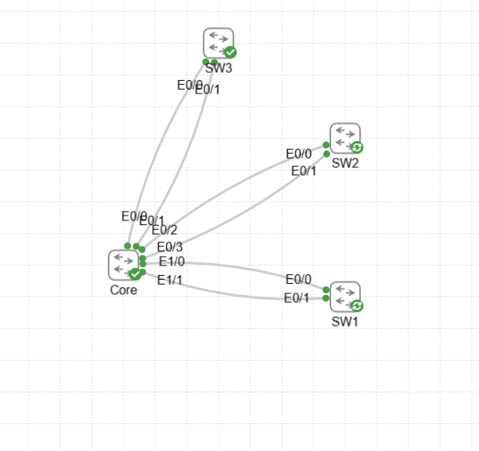
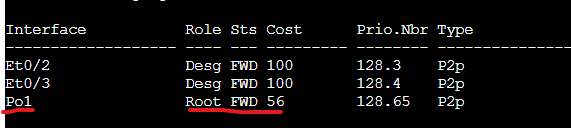

# Etherchannel Lab

In this lab we will be configuring Etherchannel on two links connecting from an access switch to a distribution switch. This resolves the issue of connecting two links between the switches and spanning-tree disabling one of the links due to a loop. These two links are now logically seen as a single link allowing for more throughput from the switch.

Assets in this lab:

Core,SW1,SW2,SW3

The Topology of this lab will be the following:

Lets display from SW1 what happens in a normal topology where 2 uplinks are connected to the Core.

As we can see there are 2 links, one is a root port in a forwarding state to the core, the other is an alternate port in a blocking state so only a single link is available. Lets configure Etherchannels 3 ways on each access switch to display what Etherchannel does.

# Unconditionally ON

Lets start with SW1 we are going to configure both ports into a port channel and there will be no negotation protocol over the etherchannel, it is considered Unconditionally ON.

Create port Channel:

SW1:  
conf t  
int Port-channel 1  
description Core-Etherchannel  
switchport trunk encapsulation dot1q  
switchport mode trunk  

Core:
conf t  
int port-channel 3  
description SW1  
switchport trunk encapsulation dot1q  
switchport mode trunk  

Add interfaces into port-channel:

SW1:  
conf t  
int range e0/0 - 1  
description Core-Trunk  
switchport trunk encapsulation dot1q  
switchport mode trunk  
channel-group 1 mode on

Core:
conf t  
int range e1/0 - 1  
description SW1-Trunk  
switchport trunk encapsulation dot1q  
switchport mode trunk  
channel-group 3 mode on

Now that the etherchannel is configured lets take a look at SW1's spanning-tree topology.

It no longer shows E0/0 and E0/1 since they are logically bundled into PO1 from Spanning-tree's perspective. This allows both links to be utilized but there is no negotation protocol used over the port channel. This is like hardcoding the speed of a link on each end vs using a negotiation protocol like LACP/PAGP will ensure proper configuration before the link is accepted into the port channel.

Configuring an etherchannel using LACP or PAGP is just about the same as unconditional but the channel-group interface command changes.

# Configuring LACP

Let's configure LACP on SW2.

SW2:  
conf t  
int Port-channel 1  
description Core-Etherchannel  
switchport trunk encapsulation dot1q  
switchport mode trunk  

Core:
conf t  
int port-channel 2  
description SW2   
switchport trunk encapsulation dot1q  
switchport mode trunk  

Add interfaces into port-channel:

SW1:  
conf t  
int range e0/0 - 1
description Core-Trunk  
switchport trunk encapsulation dot1q  
switchport mode trunk  
channel-group 1 mode active

Core:
conf t  
int range e0/2 - 3  
description SW2-Trunk  
switchport trunk encapsulation dot1q  
switchport mode trunk  
channel-group 2 mode active

Important to note: the LACP modes available are Active/Passive. As long as one side is set to Active an etherchannel will form. If you set both end to passive an etherchannel will not form as they wont be sending out any negotiation packets. If both ends are Active then a etherchannel will form.

Let's take a look at the etherchannel summary as well as the spanning-tree topology.

Just like SW1 the spanning tree topology now only shows the local port channel within spanning tree in a forwarding state allowing both links to be in an online state.

As you can see from the etherchannel configuration port-channel 2 is using LACP as a negotiation protocol vs null for port channel 1. The P defined in the state beside the port means its bundled in the port channel if it was a D it would be down and not bundled. 

# Configure PAGP

Let's configure PAGP on SW3.

SW3:  
conf t  
int Port-channel 1  
description Core-Etherchannel  
switchport trunk encapsulation dot1q  
switchport mode trunk  

Core:
conf t  
int port-channel 1  
description SW3   
switchport trunk encapsulation dot1q  
switchport mode trunk  

Add interfaces into port-channel:

SW3:  
conf t  
int range e0/0 - 1
description Core-Trunk  
switchport trunk encapsulation dot1q  
switchport mode trunk  
channel-group 1 mode desirable

Core:
conf t  
int range e0/0 - 1  
description SW3-Trunk  
switchport trunk encapsulation dot1q  
switchport mode trunk  
channel-group 1 mode desirable

Important to note: the PAGP modes available are Desirable/Auto. Exactly like LCAP if at least one end is configured with Desirable it will form an etherchannel or if both are desirable. If both are auto they will not send any negotiation packets and a channel will not form.

Just like on SW1 and SW2 the spanning-tree topology will show port channel 1 within the topology vs the individual interfaces allowing both to be in a forwarding state.

As you can see from the Etherchannel summary the negotiation protocol is seen as PAGP. This is cisco proprietary, if you are forming etherchannel also knows as link-aggregation on a different vendor switch/router you will need to use LACP.

We will now test taking and interface down on SW2 to show what the updated port channel summary will look like.

The port E0/1 can be seen in the D state as it is down but since E0/0 is still bundled into the port channel. Because of this traffic will continue to flow over the available link.