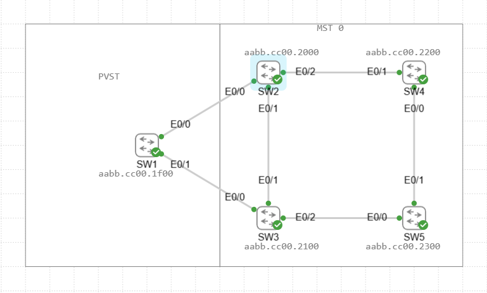

# STP Lab

In this Lab we will be configuring a looped network topology to display how spanning-tree protocol works to block looped links in a network. We will also be displaying how PVST or PVRST reacts when connected to a MST instance.

We will then follow this lab up with an etherchannel lab to display how we can virtually combine both links to achieve full bandwidth.

Assets in the Lab:

SW1,SW2,SW3,SW4,SW5

We will be connecting the switches in the following Topology:

