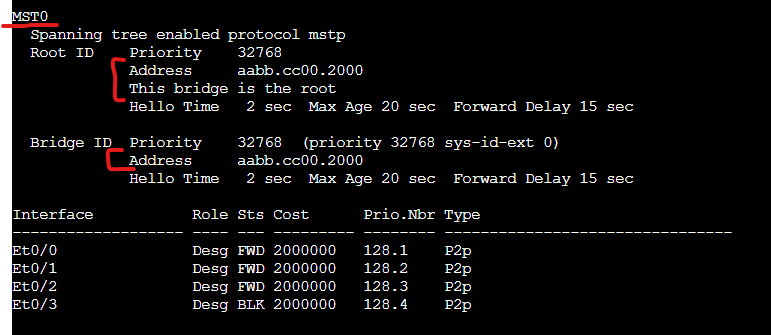
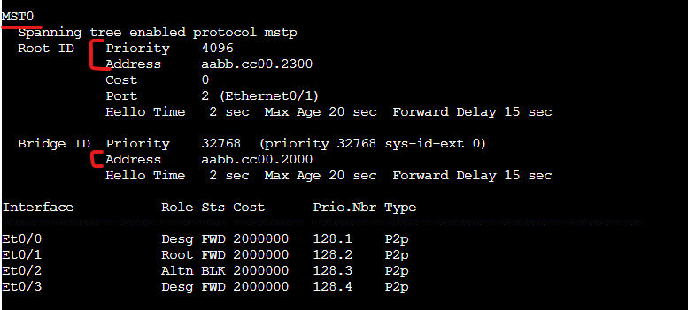
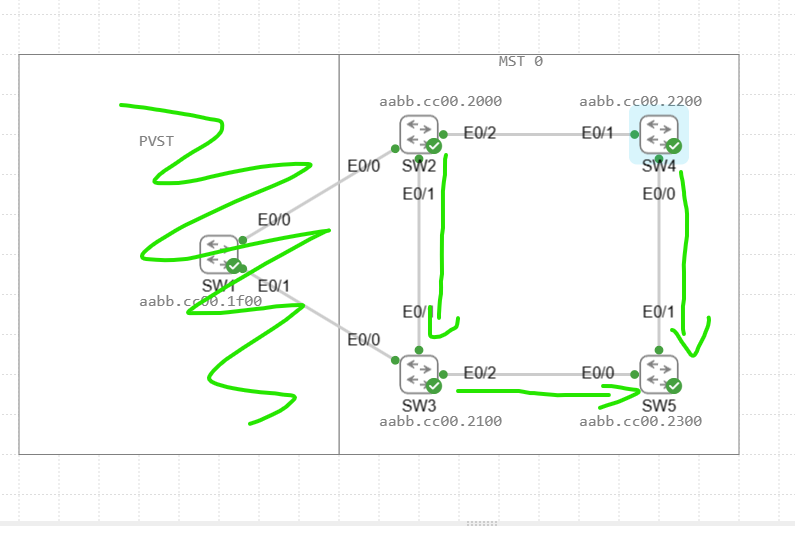

# STP Lab

In this Lab we will be configuring a looped network topology to display how spanning-tree protocol works to block looped links in a network. We will also be displaying how PVST or PVRST reacts when connected to a MST instance.

We will then follow this lab up with an etherchannel lab to display how we can virtually combine both links to achieve full bandwidth.

Assets in the Lab:

SW1,SW2,SW3,SW4,SW5

We will be connecting the switches in the following Topology:

Lets create our spanning-tree MST region. This will need to match on all switches.

SW:
conf t  
spanning-tree mst configuration  
name LAB  
revision 0  
exit  
spanning-tree mode mst  

The MST instance to VLAN mapping must match. In this case MST0 contains vlans 1-4094.

Now that all the switches are configured let's look on SW2's spanning tree table to see the result.

As we can see from this SW2 is the root bridge. Why is that? The reason its the root bridge is not because of the priority as all of those were left as default. It due to SW2 having the lowest MAC address.

Let's demonstrate how we can influence the root bridge by changing the priority.

On the switch we would like to make our root bridge we run the following commands.

SW5:

conf t
spanning-tree mst 0 priority 4096

You also have the option to run "spanning-tree mst 0 root primary" which will automatically make it the lowest priority out of the current bridge ID's.

Now lets look at SW2's spanning tree table again.

As we can see the Root ID is now aabb.cc00.2300 and the priority is 4096. If we go back to the topology we can see aabb.cc00.2300 is the MAC of SW5.

# Calculating Root/Designated/Blocking Ports

Next we need to calculate the Root ports. This is done by selecting the link with the lowest cost to the root. Next is through the bridge with lowest ID then its up to the link with the lowest port number EX: E0/0 > E0/1.

Based on that information we get the following Root ports.

