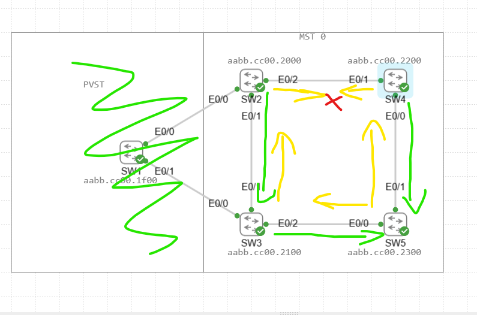
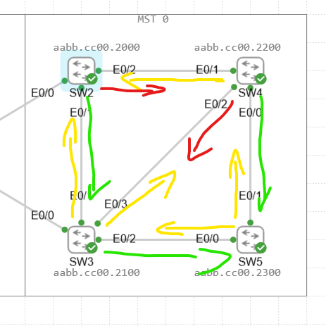
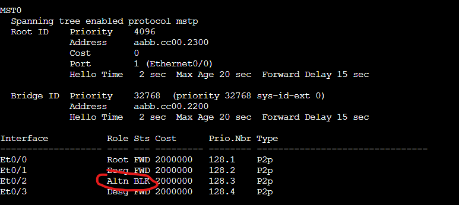
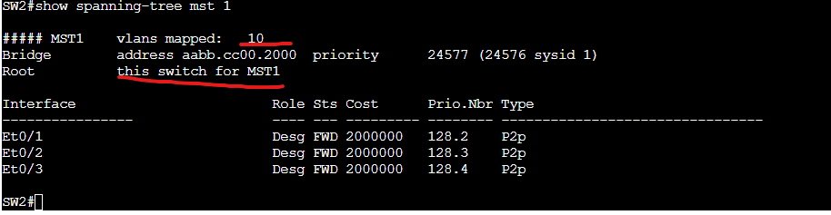
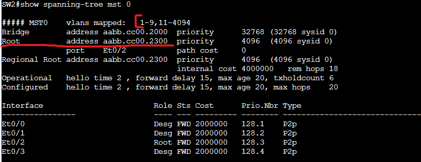

# STP Lab

In this Lab we will be configuring a looped network topology to display how spanning-tree protocol works to block looped links in a network. We will also be displaying how PVST or PVRST reacts when connected to a MST instance.

We will then follow this lab up with an etherchannel lab to display how we can virtually combine both links to achieve full bandwidth.

Assets in the Lab:

SW1,SW2,SW3,SW4,SW5

We will be connecting the switches in the following Topology:

Lets create our spanning-tree MST region. This will need to match on all switches.

SW:
conf t  
spanning-tree mst configuration  
name LAB  
revision 0  
exit  
spanning-tree mode mst  

The MST instance to VLAN mapping must match. In this case MST0 contains vlans 1-4094.

Now that all the switches are configured let's look on SW2's spanning tree table to see the result.

As we can see from this SW2 is the root bridge. Why is that? The reason its the root bridge is not because of the priority as all of those were left as default. It due to SW2 having the lowest MAC address.

Let's demonstrate how we can influence the root bridge by changing the priority.

On the switch we would like to make our root bridge we run the following commands.

SW5:

conf t
spanning-tree mst 0 priority 4096

You also have the option to run "spanning-tree mst 0 root primary" which will automatically make it the lowest priority out of the current bridge ID's.

Now lets look at SW2's spanning tree table again.

As we can see the Root ID is now aabb.cc00.2300 and the priority is 4096. If we go back to the topology we can see aabb.cc00.2300 is the MAC of SW5.

# Calculating Root/Designated/Blocking Ports

Next we need to calculate the Root ports. This is done by selecting the link with the lowest cost to the root. Next is through the bridge with lowest ID then its up to the link with the lowest port number EX: E0/0 > E0/1.

Based on that information we get the following Root ports.

Next lets determine the Designated ports. This one is easy, on the Root Bridge all ports are designated. on all other switches all non root ports are designated ports.

BUT WAIT! They can't all be Designated ports can they now... SW2 and SW4 have a conflict both cant be designated or else they will be forwarding and there would be a loop. One switch has to set their link to blocking.

In this case its a simple choice. SW4 is closer to the root with a lower root cost as it only has to traverse one link but SW2 has to traverse both the link to SW4 and then to the root which makes it the least preferred of the two.

Lets change things and connect SW3 and SW4 together. Both switches are 1 link away from the root. What happens to the link between the two of them?

If we look back at the topology since the priority and the cost are the same it will be up to the lowest MAC. in this case SW3 has the lower MAC address and therefor will be the designated port on that segment.

Lets confirm in the STP table of SW4 that the port is in a blocking state.

As expected E0/2 is in a blocking state. 

# Creating Multiple MST instances

Next I will create multiple MST instances and map vlan 10 to instance 1. We will also be changing to root bridge for instance 1 which will demo how you can logically utilize all links by having some links up for certain vlans but down for others based on the instance and the Root ID.

On the switches we will run the following

SW:

conf t  
vlan 10  
name Demo  
exit  
spanning-tree mst configuration  
instance 1 vlan 10  
exit  

We will also make SW2 the root bridge using the following command.

spanning-tree mst 1 root primary

lets see the results from the SW2 spanning-tree table

As you can see SW2 is the root for MST1 which contains vlan 10.

Now lets look again at MST0

We can see that SW5 is still the root for MST0 which contains vlan 1-9 and 11-4094.

In another lab we will look at how MST can do PVST simulation if there are PVST only routers attached into a MST region.

