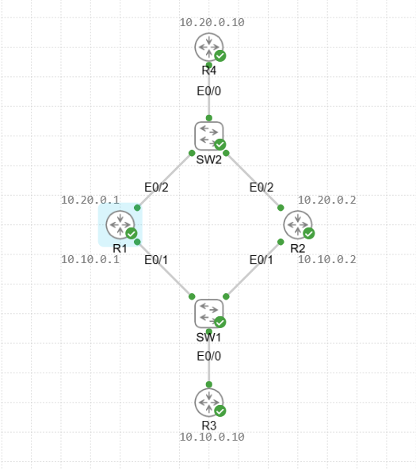
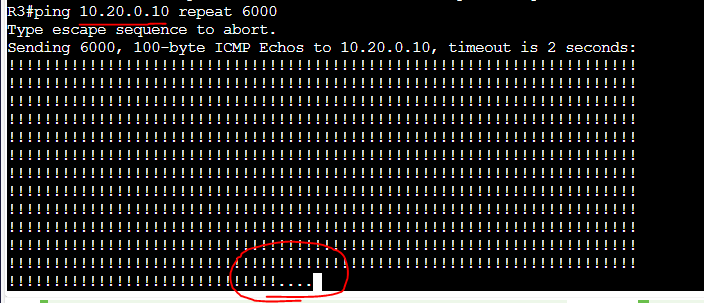
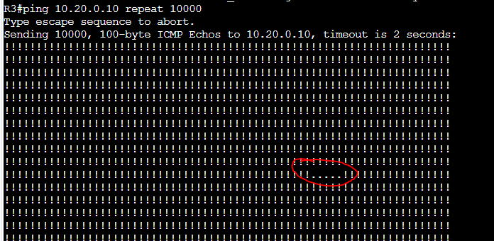
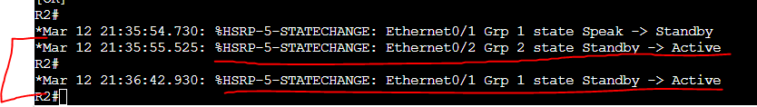

# HSRP Lab

In this lab we will be configuring 2 routers in a HSRP group for first hop redundancy to a downstream client. In this case it will be another downstream router which has these two routers as its default gateway.

Assets in this lab:

R1,R2,R3,R4,SW1,SW2

The topology for this lab will look like the following:

Now that the networks are configured we will test a ping from R3 to R4 and this is using a default route on the routers that go through R1. We will then shutdown R1 too see the result of that ping.

Due to us shutting down R3's default gateway (R1) the pings stopped flowing to 10.20.0.10 and the only way to bring that connectivity back is by bringing that default gateway back online.

We are now going to configure HSRP to bring R2 into the picture and allow the two to send each other heartbeats so that the standby router can take over when the Active router goes offline.

To configure HSRP run the following on R1 and R2.

R1: 

conf t  
interface e0/1  
standby 1 ip 10.10.0.3  
standby version 2  
standby 1 priority 110  
interface e0/2  
standby 2 ip 10.20.0.3  
standby version 2  
standby 2 priority 110 

R2: 

conf t  
interface e0/1  
standby 1 ip 10.10.0.3  
standby version 2  
interface e0/2  
standby 2 ip 10.20.0.3  
standby version 2   

Since I have set priority of 110 on R1 if both come up at the same time it will be the active router.

Now lets check the standby config.

As we can see R1 is the active router and R2 is the standby router due to the priorities set for both HSRP groups which connect to each downstream router.

Now we need to change the gateway of the routers to point to the HSRP virtual IP of .3 on each network and test again.

R3:  
ip route 0.0.0.0 0.0.0.0 10.10.0.3  

R4:  
ip route 0.0.0.0 0.0.0.0 10.20.0.3

Let's test now.

From these pings we can see where R1 went down and where R2 picked up the load. Due to R2 still being in speaking state is took a bit of extra time compared to normal in this test.

From this you can see the R2 router changing from the standby state into the active state and picking up the traffic for the pings coming from R3. this also changed for the second HSRP group facing R4 so both ends changed routers for their path resulting in significantly lower down time when R1 went offline due to a reload.

