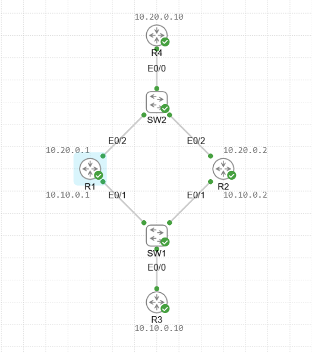
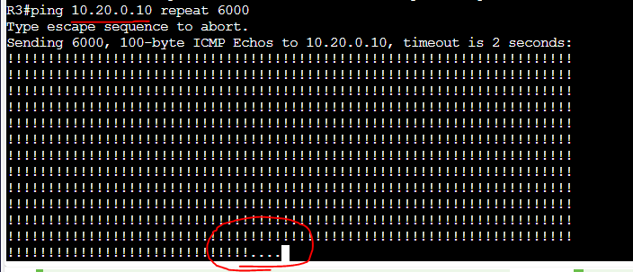

# VRRP Lab

In this lab we will be configuring 2 routers in a VRRP group for first hop redundancy to a downstream client. In this case it will be another downstream router which has these two routers as its default gateway.

Assets in this lab:

R1,R2,R3,R4,SW1,SW2

Topology for the Lab:

Now that the networks are configured we will test a ping from R3 to R4 and this is using a default route on the routers that go through R1. We will then shutdown R1 too see the result of that ping.

Due to us shutting down R3's default gateway (R1) the pings stopped flowing to 10.20.0.10 and the only way to bring that connectivity back is by bringing that default gateway back online.

We are now going to configure VRRP to bring R2 into the picture and allow the two to send each other heartbeats so that the Backup router can take over when the Master router goes offline.

To configure VRRP run the following on R1 and R2. We will be configuring 2 VRRP groups one for the 10.10.0.0/24 network and one for the 10.20.0.0/24 network so that both send and return traffic between R3 and R4 are redundant.

R1: 

conf t  
interface e0/1  
vrrp 1 ip 10.10.0.3   
vrrp 1 priority 110  
interface e0/2  
vrrp 2 ip 10.20.0.3  
vrrp 2 priority 110 

R2: 

interface e0/1  
vrrp 1 ip 10.10.0.3   
interface e0/2  
vrrp 2 ip 10.20.0.3   

Since I have set a priority of 110 on R1 if both come up at the same time it will be the Mater router. Preempt is also enabled so by default R1 will always become the master as long as its online. We will test that out later in the lab.

Now lets check the VRRP config.

As you can see R1 is the master router with a priority of 110.

Now we need to change the gateway of the downstream routers to point to the VRRP virtual IP of .3 on each network and test again.

R3:  
ip route 0.0.0.0 0.0.0.0 10.10.0.3  

R4:  
ip route 0.0.0.0 0.0.0.0 10.20.0.3

Let's test now.

As we can see there were only 2 pings lost when R1 went offline. We can also see the message from R2 changing state from Backup to Master.

Next we will bring R1 back online to show the Preempt state changes back to Master for R1 when it comes online and Backup for R2.

As you can see R2 becomes the backup router now that R1 has come back online.