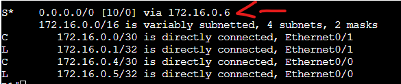

# IPSLA Lab

In this Lab we will be demonstrating the use of IPSLA's in a static routing environment to create a floating static route configuration.

Assets in this lab:

R1,R2,R3

Topology for the lab:

We will be using IPSLA allow an automated failover to occur when the internet is no longer reachable direct from the R3 router on R1. We will failover to flow the default route through the R2 router and up. The monitoring will be done to the loopback behind R3 which will simulate pinging an address on the internet.

We have configured the connected networks and R2 has been configured with a default route up to R3 through E0/1. Let's test to ensure connectivity to the internet is functioning.

It can reach the internet. Now let's configure R1's 2 default routes. One direct with IPSLA and a floating static route through R2.

R1:  
conf t  
ip sla 1  
icmp-echo 192.168.1.1 source-interface ethernet0/1  
end  

Now let's run a show ip sla summary. 

As we can see there is a IP SLA but it is not running as there is no status.

R1:   
conf t  
ip sla schedule 1 life forever start-time now  

The SLA is now actively sending ICMP messages to one of our internet addresses behind R3 out of E0/1

We now need to create a track which is a tracking object which references the IP SLA.

R1:  
conf t  
track 1 ip sla 1 state  

We can now see the tracking object is configured. Take note that in the tracked by we have no routes using this track.

Let's configure our static default route using tracked objects.

R1:  
conf t  
ip route 0.0.0.0 0.0.0.0 172.16.0.2 track 1  

We can now see the primary default route is through R3.

Let's trace through R3 our internet resource (192.168.1.2). This resides under R3 and is not directly connected to R1 so it will be using the default route.

We can see the traceroute passed directly through R3.

Let's take down 192.168.1.1 which R1 is tracking to see how the router reacts.

As we can see the SLA went into a down state and the route table converged so the default route is now the higher administrative distance route through R2.

Let's re-run the ping to ensure traffic is flowing as expected to our internet address (192.168.1.2)

Success

As we can see the traffic is now flowing through R2 up to R3 now that the Routing table has changed to the floating static route allowing internet access through a secondary link due to IP SLA tracking.

(Outside of a lab environment there would be a few additions to this lab  which include NAT'ing the source traffic from 1.1.1.1 to the inside global address of the router. We worked around this with some static routing on R3 and R2 but normally this is not required while using NAT as it egresses R2 and R1.