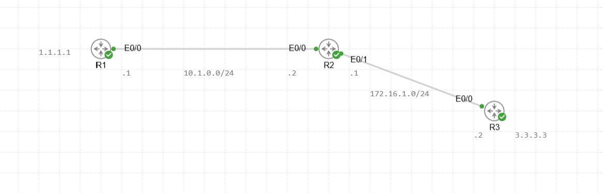
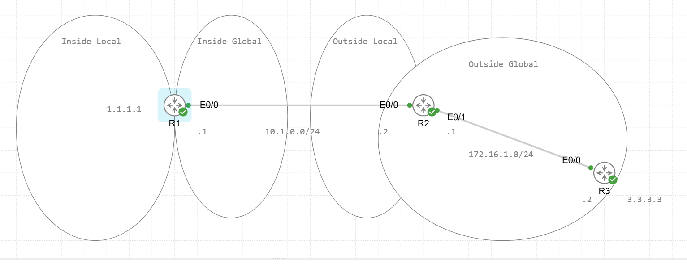
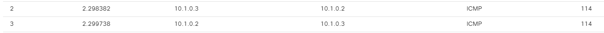
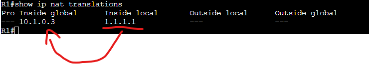
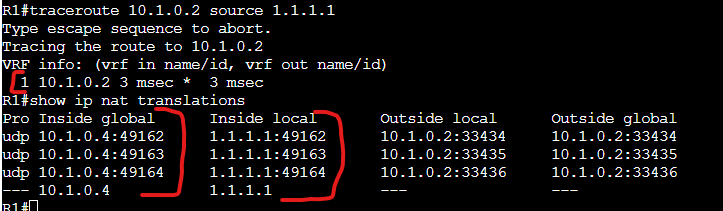
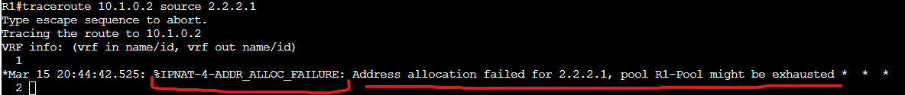
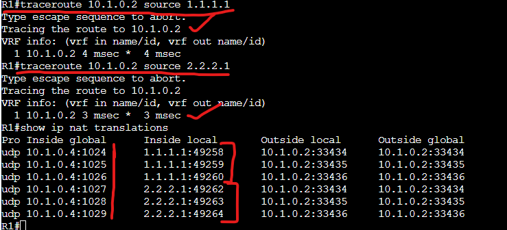
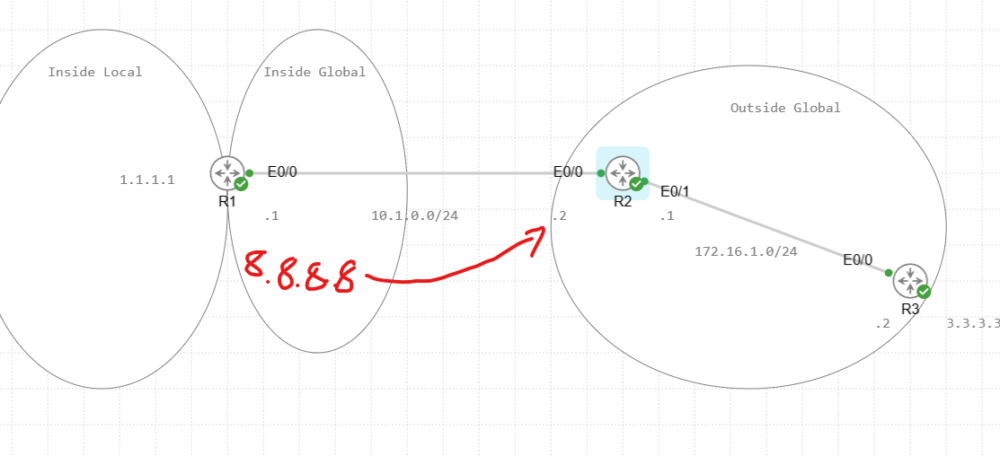
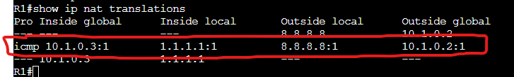
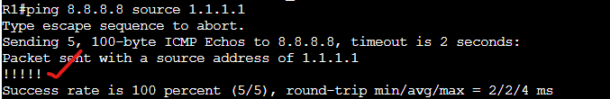

# NAT Lab

In this lab we will be creating multiple NAT configurations to display the different NAT use cases.

Topology for this lab:

# Static NAT

First we will configure Static NAT on R1 to mask the inside address on the outside interface.

Lets first define the zones within the topology.

In this you can see the inside local/global as well as outside local/global zones. In this example we will be NAT'ing the Inside local zone to an IP on the inside global address space. From the outside global perspective the traffic will be coming from the inside global address.

To define the zones you use the following command on the interface level:

ip nat (inside) or (outside)

Inside is where your endpoints and local networks live. Outside normally points to the internet or an external connection. This is not mandatory you can use outside to define the inside and inside to define the outside.

On R1 we defined the loopback interface as the inside zone and E0/0 as the outside zone.

Now let's create the static NAT to transform 1.1.1.1 from the inside zone to 10.1.0.3/24 going to the outside zone. Once we apply static NAT, 10.1.0.3 is assigned to 1.1.1.1, any other inside address cannot use this IP as this is a static assignment.

R1:  
ip nat inside source static 1.1.1.1 10.1.0.3

Let's now run a ping to 10.1.0.2 and see the result through a packet capture on the E0/0 interface.

As we can see the interface capture shows the source traffic coming from 10.1.0.3 which is a result of R1 NAT'ing the traffic before sending it out that interface.

Here is a look at the NAT translation table.

We can see this entry lives in the NAT table even if its not passing any traffic at the time. 1.1.1.1 will translate to 10.1.0.3.

Also note that traffic can be sourced from R2 facing this inside global address of 10.1.0.3 and it will be translated to the inside local address of 1.1.1.1. Also referred to as Destination NAT vs the test we just ran is considered a Source NAT.

# Dynamic NAT

Next we will explore dynamic NAT which is similar to static NAT but this will be applies to multiple inside local addresses based on ACLs that dictate which traffic matches for NAT'ing purposes. This can NAT to a single address using PAT (We will explore that later) or to a pool of addresses on the inside global level. If you do not use PAT then you can only NAT as many inside local clients as you have inside global addresses in the address pool.

# Configure Address Pool

R1:  
conf t  
ip nat pool R1-Pool 10.1.0.4 10.1.0.4 prefix-length 24

This configured a pool of only a single address from 10.1.0.4 to 10.1.0.4. The reason I did it will be to display the use case for PAT coming soon.

# Configure ACL

R1:  
conf t  
ip access-list extended NAT  
permit ip 1.1.1.0 0.0.0.255 any  
permit ip 2.2.2.0 0.0.0.255 any  

I have configured a secondary loopback on R1 with the address of 2.2.2.1 which we will be sending traffic through to R2.

# Configure the NAT Rule

R1:  
conf t  
ip nat inside source list NAT pool R1-Pool

Let's now send a traceroute to R2 from R1's 1.1.1.1 loopback.

We can see the NAT translation to the inside global address of 10.1.0.4 going to the outside global address of 10.1.0.2.

Now let's follow this up with a traceroute from 2.2.2.1

As we can see here the router fails to translate the traffic from 2.2.2.1 since the address pool is exhausted as the 10.1.0.4 address is assigned to 1.1.1.1. To solve this permanently we have 2 options. Increase the address pool to a size larger than the inside addresses its translating as one inside global will be matched with one inside local address. Our other option is to enable PAT or Port address translation. This allows the firewall to overload a since inside global address to handle multiple inside local addresses by keeping track of each source port for the sessions generated and returning traffic to each inside local client based on the return traffic and its destination port. I will demonstrate by changing out NAT rule and running the same test on R1.

# Configure PAT

First we will change our NAT command.

R1:  
conf t  
ip nat inside source list NAT pool R1-Pool overload  

With this overload command we will not be using PAT.

Let's re run out test.

As we can see both traceroutes completed successfully. Lets look at the first translation as our example.

In that first translation 1.1.1.1 on port 49258 sent traffic to 10.1.0.2 and R1 translated that first session over ip 10.1.0.4 on port 1024. when R2 responds to the traceroute it will have a destination address and port of 10.1.0.4 port 1024 which R1 now knows it needs to forward to 1.1.1.1. The same applies for 2.2.2.2 its first session was translated to ip 10.1.0.4 but on port 1027. When R2 returns traffic to R1 with a destination of 10.1.0.4 over port 1027 it knows that it is destine for 2.2.2.2. This is how almost all internet facing routers are configured to ensure we extend the life of IPv4 as long as they can because if we had to have a single public IP for each internal device we would have ran out of public IP addresses a long time ago.

# Configure Outside Source NAT

In this example we will be configuring 2 WAY NAT which will translate an address destine for an outside local address on R1 to a different outside global address.

This is the look from our topology. R1 will mask the address of 10.1.0.2 behind 8.8.8.8 so that if inside local clients want to reach 10.1.0.2 they will send traffic to 8.8.8.8.

To configure outside source NAT run the following:

R1:  
conf t  
ip nat outside source static 10.1.0.2 8.8.8.8  

We will also re-instill the static NAT for the R1 loopback address

R1:  
conf t  
ip nat inside source static 1.1.1.1 10.1.0.3

Important to note: You need to have a route in the routing table available for the inside local address or else the translation will never happen as the packet is dropped due to no routes being available.

From this packet we can see the inside local address of 1.1.1.1 sourced an ICMP message. This ICMP message was being sent to 8.8.8.8. Since we have Static NAT enabled 1.1.1.1 is translated to 10.1.0.3 upon exiting R1 and due to the outside source NAT it was destined for the 10.1.0.2 outside global address.

As we can see the ping completed successfully.

