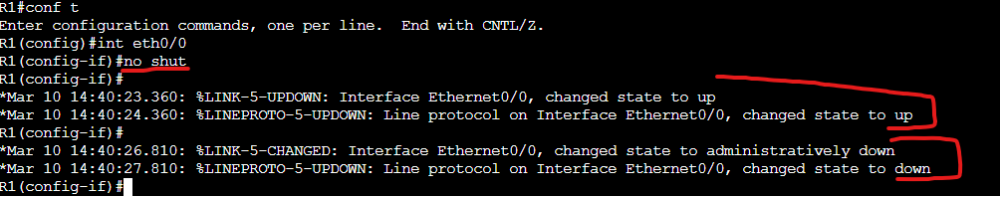
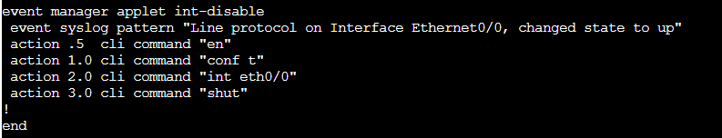

# EEM Applet LAB

In this Lab we will be creating some automation on a router using EEM applets. These are done locally on the router and can perform all the same commands that you could run normally on the router based on a trigger event or through a manual run.

Assets in this Lab:

R1

We are running this on a single router so there is no Topology to display.

Let's start by making a simple EEM applet to re-disable an interface when it is enabled.

R1:  
conf t  
event manager applet (Enter applet name) I will use "int-disable"  

Next you will be in the applet configuration. Here is where you define the events and actions. The easiest and most versatile event is through syslog which looks through the router log and can do an action based on a sys log message. There are plenty of other events that can be triggered based on interface/routing events etc.

To create the syslog event we will run the following under the applet configuration mode.

R1:

event syslog pattern "Line protocol on Interface Ethernet0/0, changed state to up"

Keep note that if your pattern utilizes spaces it need to be placed within quotes.

Next let's configure the action. Again there are many action options but we will opt for the simplest and most versatile which is cli command options. Under the EEM applet configuration run the following.

R1:  
action .5  cli command "en"  
action 1.0 cli command "conf t"  
action 2.0 cli command "int eth0/0"  
action 3.0 cli command "shut"  

This action will re-disable the interface when it sees in the log the state was changed to up. Let's see it in action.

As you can see once the interface was placed into a up state the EEM applet ran and re-disabled the interface.

In the running configuration your EEM applet will look like the following.

