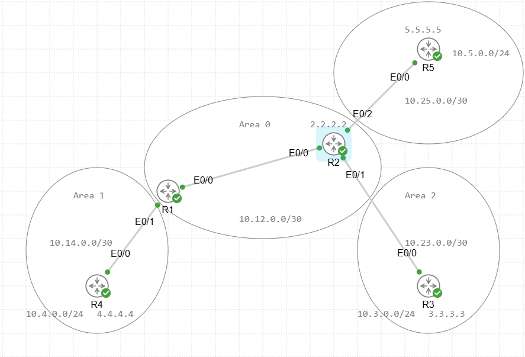
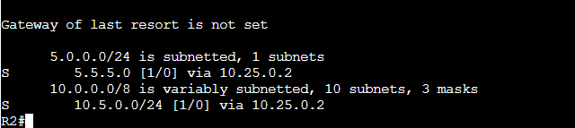
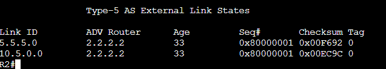
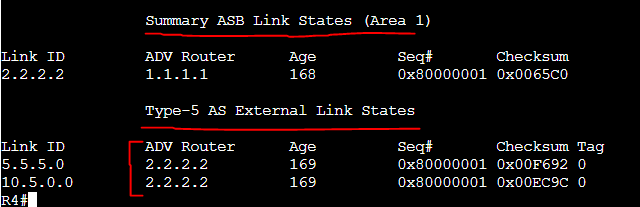
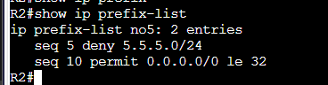
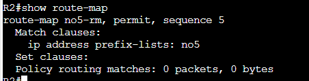
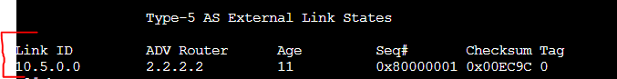
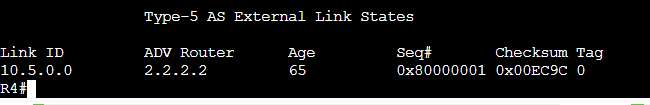
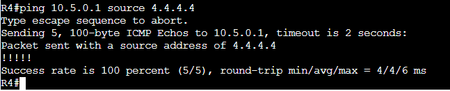
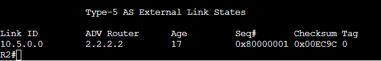

# ASBR Redistribution Lab

In this lab we will be building upon the multi-area ospf configuration and making R2 a ASBR which will redistribute 2 static routes from its routing table into OSPF as Type 5 LSA's.

Assets in this Lab:

R1,R2,R3,R4,R5

Topology for this lab will be the following:

On R5 we have configured a default route to point to R2 for return traffic. On R2 we have configured 2 static routes.

ip route 5.5.5.0 255.255.255.0 10.25.0.2  
ip route 10.5.0.0 255.255.255.0 10.25.0.2

These point to the two networks available on R5. Let's confirm they are in the routing table of R2.

As you can see there are two routes in the routing table of R2 now.

# Redistributing the routes into OSPF

To accomplish this we will run a single command in the router configuration of R2.

R2:  
conf t  
router ospf 1  
redistribute static subnets  

WARNING! If you do not put subnets in the redistribution command it will only redistribute classful address spaces and if they don't conform the redistribution will not work.

Let's take a look back on the OSPF database on R2 then on R4 in area 1.

We can see the Type 5 LSA in the database with the advertising router as 2.2.2.2. Now for R4.

We can see the same Type 5 LSA on R4 but the advertising router is still 2.2.2.2 even though its crossed through an area. If you go back to the multi-area lab I demo'd we can see that the ABR is the adv router normally for Type 3 LSA's. This is not the case for Type 5 LSA's.

This is why there are Type 4 LSA's that come along with the Type 5 which creates an entry indicating to get to 2.2.2.2 go to 1.1.1.1 which is R4's ABR.

Interestingly if you look at R3's database since its directly connected to the ASBR it does not have a Type 4 LSA. It only has the Type 5 LSA and this is because it is directly connected to this ASBR/ABR there is already a Type 1 LSA that details its router link.

# Route-Map Filtering for redistribution

Next we are going to try and filter out the 5.5.5.0 network within R2's redistribution profile.

# Create Prefix-list

First lets create a prefix list. (you can also use an access-list I will demo that at the end of the lab)

R2:  
conf t  
ip prefix-list no5 deny 5.5.5.0/24
ip prefix-list no5 permit 0.0.0.0/0 le 32

Unlike an access-list this deny is denying the route from advertising when placed in a route-map. 

# Create Route-Map

Next we will create the route-map that is used in the redistribution command that calls the prefix-list.

R2:  
conf t  
route-map no5-rm permit 5
match ip address prefix-list no5
exit

# Apply to Redistribution

No that we have the route-map we apply it to the redistribution. To do this we have to no out the other command.

R2:  
conf t  
router ospf 1  
no redistribution static subnets
redistribution static subnets route-map no5-rm

With that applies lets check R2's ospf database.

The 5.5.5.0 Type 5 LSA is no longer in the ospf Database. Let's confirm on R4 as well.

The same result! 5.5.5.0 is completely filtered on on the OSPF network.

Finally we forgot to test a ping to a network connected on R5. From R4 lets run a ping to R5's 10.5.0.1 address.

Success!

That concludes the Lab for OSPF ASBR route redistribution as well as route filtering using a prefix-list. 

# Extra!  
# Using Access-lists for filtering

I have tested filtering using access-lists before if you are more comfortable with those they are close to the same but in your access list you will want to do the following.

conf t
ip access-list extended no5
permit ip 5.5.5.0 0.0.0.255 any
deny ip any any

You can do a permit or deny clause based on the following 3 conditions.

-If you use an ACL in a route-map permit clause, routes that are permitted by the ACL are redistributed.  
-If you use an ACL in a route-map deny clause, routes that are permitted by the ACL are not redistributed.  
-If you use an ACL in a route-map permit or deny clause, and the ACL denies a route, then the route-map clause match is not found and the next  route-map clause is evaluated.

Now you create the route-map statements. Since we are denying matching ACL entries we need a permit statement following that in the route map. If we did the opposite and were doing a permitted networks statement in the ACL and RM then no additional RM entry is needed.

route-map no5-rm deny 5  
match ip address no5  
route-map no5-rm permit 10  

then re-apply to your redistribution command just like before as they both use route-maps to apply.

As we can see we acheived the same result using ACL's