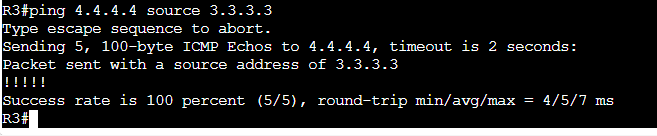

# Multi-Area OSPF Lab

In this Lab we will be configuring a multi-area OSPF instance.

Assets in this Lab:

R1,R2,R3,R4

Topology for the Lab:

To shorten the document I will only include the OSPF configuration but the link configuration is available in the Router Configuration folder.

R1:  
router ospf 1  
network 1.1.1.1 0.0.0.255 area 0  
network 10.12.0.0 0.0.255.255 area 0  
network 10.14.0.0 0.0.255.255 area 1  

R2:  
router ospf 1  
network 2.2.2.2 0.0.0.255 area 0  
network 10.12.0.0 0.0.255.255 area 0  
network 10.23.0.0 0.0.255.255 area 2  

R3:  
router ospf 1  
network 3.3.3.3 0.0.0.255 area 2  
network 10.23.0.0 0.0.255.255 area 2  
network 10.3.0.0 0.0.255.255 area 2  

R4:  
router ospf 1  
network 4.4.4.4 0.0.0.255 area 1  
network 10.14.0.0 0.0.255.255 area 1  
network 10.4.0.0 0.0.255.255 area 1  

If we look at the OSPF neighbor tables of R1 and R2 we can see all the neighbors are now formed.

Next let's run a show ip ospf interface brief to show the interfaces participating in OSPF.

Since we have interfaces in more than 1 area this makes R1 and R2 and Area Border Router or ABR. (That can be seen using the show ip ospf command)

Lets now take a look at the ospf database LSA type 3's on R2 for Area 0 to see what routes have been learned from R1 in Area 1.

As we can see here R2 has 3 LSA type 3 entries for networks within the Area 1 network. the loopback and network under R4 as well as the transit network between R1 and R4. R2 will then advertise that down as a LSA type 3 into area two for R3 to place in its ospf database but lets see how it differs.

Under R3:

We can see R3 has all the LSA type 3's under Area 2. It also shows that the adv router or advertising router is R2 for all routes as that is the ABR for the area.

Let's see how this all looks in the routing table of R3.

We can see all the networks are available in the routing table and are marked with the "O" "IA" tags as theses are OSPF generated routes but they are also marked as Inter-area routes indicating they have come from an area outside of its own area.

Let's run a ping through the network to R4.

Success. In the next Lab we will be building upon the Multi-Area OSPF configuration by adding routes and filtering through an ASBR router.

