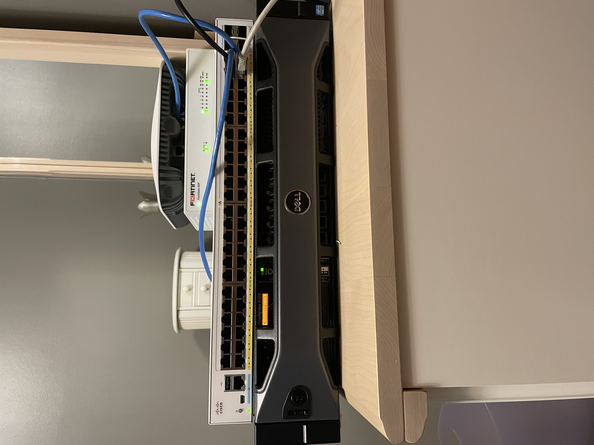

# Jbirch-Homelab

Welcome to the Documentation of my Home Lab. These are virtual labs or demonstrations made and documented by myself during my studies for various certifications.

Legend:

The .MD file under each sub folder shows the documentation of the lab
The "Router Configuration" sub folder in the lab is a copy of the routers configurations in case someone wanted to bring this up in their own lab (CML,EVE,GNS3)

