#  Home-Lab Network Segmentation Series

In this lab we are going to take a look at some basic segmentation concepts using a PA firewall to display how we can take a flat network with very few point of enforcement and transform this using some simple concepts to enhance security and visibility.

As seen in this first topology this is what we would consider an almost flat network. 2 networks that are connected at the L3 boundry by a simple L3 switch or router. Policy through ACL can be difficult to create an manage as policies grow. We could potentially also see both the user and the server network reside within the same L3 broadcast domain eliminating any ability to attempt to apply ACL's.

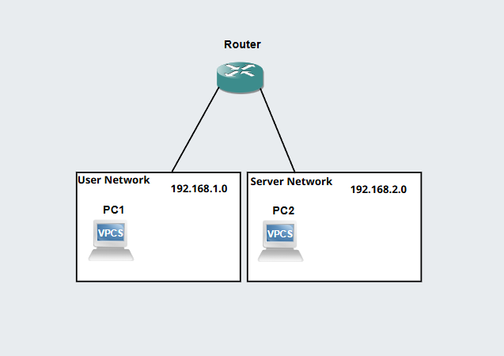

To combat this flat network we are going to move the L3 boundry to terminate at a firewall so we can both use source/destination VLAN or Zones to better manage traffic policies between these boundries. The new topology will have the following look.

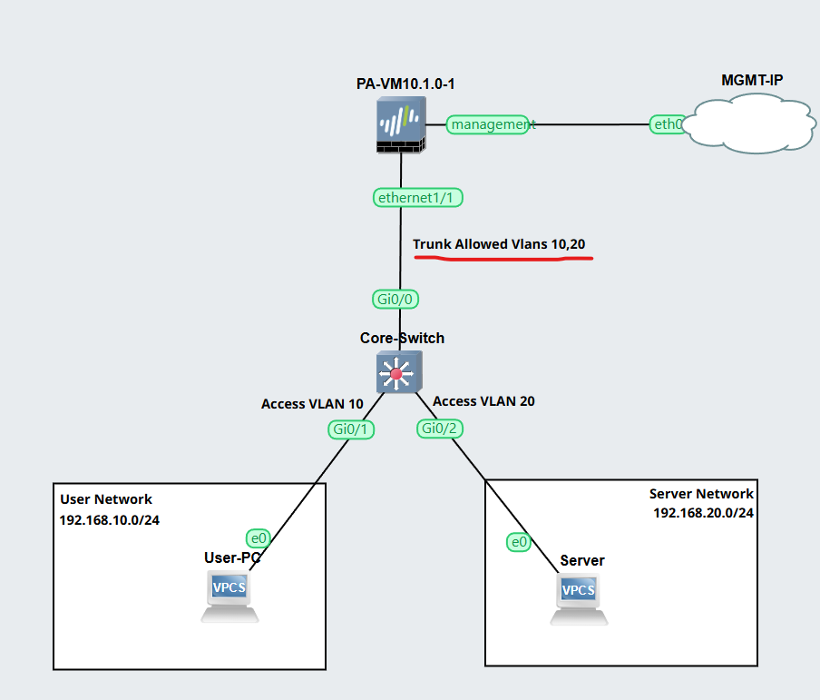

We now remove L3 routing and ACL's from the switch/router and only move traffic on a L2 level through this device up to our enforcement point at the firewall. Let's dive into the first concept of segmentation which seperates the traffic between the user and the server network.

# Vlans

Vlans essentially isolate broadcast domains by using frame tagging on the L2 layer to ensure that traffic within one vlan cannot hop over to another vlan's boundry without going through the L3 boundry routed by a firewall or router/L3 switch. This enables us to segment broadcast messages as well as overall visibility between two vlans. This is especially important when segmenting user or corporate networks to guest networks to ensure they cannot connect in and quickly gain visibility into all your corporate assets.

In the example created we have setup 2 vlans. vlan 10 and vlan 20.

Vlan 10 is our Corporate User Network.  
Vlan 20 is our Corporate Server Network.

We will run the following commands to create the 2 vlans.

conf t  
vlan 10  
name User-Network  
exit  
vlan 20 
name Server-Network  

Then we need to create the port configurations

conf t   
int gi0/1  
description User-Port  
Switchport mode access  
Switchport access vlan 10  
exit  
int gi0/2  
description Server-Port  
Switchport mode access  
Switchport access vlan 20  

We also need to configure the trunk link upstream to our firewall appliance.

conf t  
int gi0/0  
description Trunk-To-PA  
Switchport trunk encapsulation dot1q   
Switchport mode trunk  
Switchport trunk allowed vlan 10,20  

Now that we have the trunk configured we will move to the firewall appliance to configure the sub interfaces on the trunk and apply zones to segment the traffic.

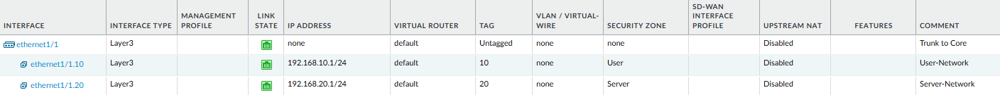

As we can see from the picture we configured 2 sub interfaces on the trunk port. We have defined the Layer 3 network that will be used as well as associated the vlan tag to each sub interfaces that way traffic sent/received through that sub interface will be sent with the matching vlan tag to the switch. Additionally you can see the zone configured on each subinterface is how we will define our policies to flow.

Now if we try to ping from the user to the server it will fail as there is currently no policy in place to enable traffic between these two interfaces in seperate zones.

User-PC IP Address:  
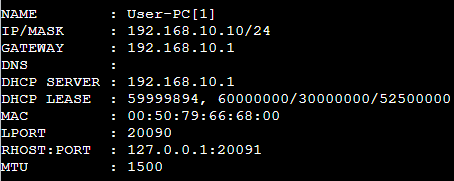

Server IP Address:  
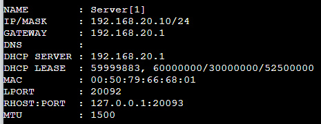

Ping Attempt from User-PC to Server:  
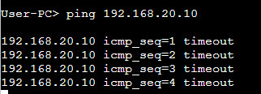

As we can see the ping failed. Let's now configure a firewall policy to enable traffic to flow over these two zones. The firewall policy we have configured is a policy in the direction of the User-PC to the server to enable ICMP messages. If the server was a Web Host we would potentially enable services like HTTP and HTTPS but for this demo ICMP will suffice.

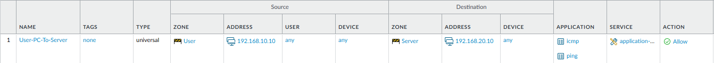

Palo Alto alongside most firewalls are stateful when it comes to policy decision. This means returned ICMP traffic which was originally sourced from the User-PC will return along the same policy. This will be important to note later as we test a ping sourced from the Server later.

Ping Attempt from User-PC to Server:  
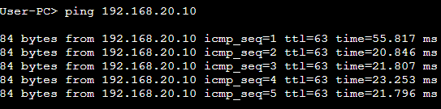

We can see this successed, now lets try in the opposite direction.

Ping Attempte from Server to User-PC:  
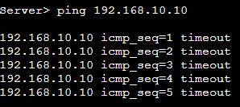

Now lets create another policy in the opposite direction.

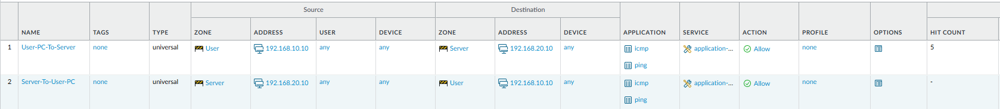

With our latest policy in place we re-run the ping to the User-PC.

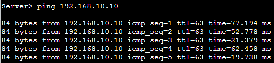

Voila, ICMP is responsive being sourced in either direction. With this in mind we might not want the server network to source traffic to the user network or perhaps we only want to allow certain traffic like HTTP/HTTPS from the user network and not more sensitive protocols like RDP. This is the added benefit we have with ROAS and VLAN segmentation with firewalls, we can be flexible on our allow rule and blocks.

That is all for this brief demo on VLAN segmentation with firewalls to better understand how to segment L3 boundries using a firewall and switch configuration. This concept expands much further as we begin to generate additional VLAN's and Zones for different asset types like DMZ resources or Crown Jewel resources.