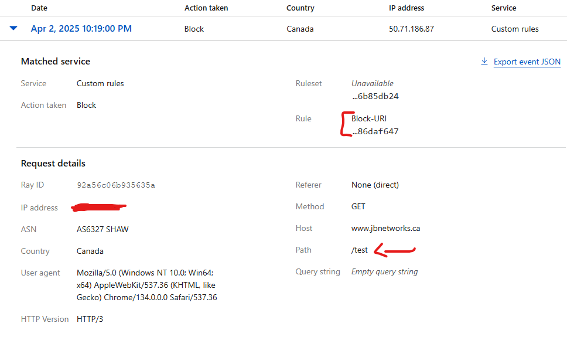

# WAF Demo

I will Demonstrating some basic functions related to WAF (Web Application Firewall) through cloudflare and applying this to a site.

# What is a WAF?

Let's first lay down a base as to what WAF is and what the intended use case of this product is.

A WAF is protection for web applications through http/https and operates at Layer 7. WAF's intention is to block against attacks pertaining web applications like Cross Site Scripting and SQL injection. The OWASP top ten is a good point of starting as most WAF's block attacks within the top ten described below.

OWASP Top Ten description:  
https://owasp.org/www-project-top-ten/

WAF's themselves do not mask the identity of the site, its intent is more like a firewall that sits infront of the web app you are protection very much like how Firewalls sit infront of critical infrastructure in a castle moat network architecture.

Let's dive into setting up WAF protection for web apps through CloudFlare.

# DNS Configuration

I am going to skip over the account creation and registering your domain into Cloudflare but at a high level it will walk you through some steps to setup a NS record from your originating registrar to allow Cloudflare to be your DNS host so all queries are answered by Cloudflare.

Now that the domain is registered and DNS is coming through Cloudflare we need to create a DNS record to point to the web application you are protecting. In my case this will be my personal portfolio site.

In my case I am setting up a CNAME which re-points resume.jbnetworks.ca to googles site hosting service.

Now that DNS is configured as long as its configured as Proxy you will get a base protection level from cloudflare by default. Let's enhance this with some Custom WAF rules.

# Creating WAF Rules

To configure WAF Custom rules go to Security > WAF  > Custom Rules.

Managed Rules require additional licensing on cloudflare but we gain a predefined set of security with our free plan as mentioned. We are going to take this a step further with some specific rules that I want to have in place on my site.

The two rules we are going to be demonstrating are as follows:

1: Create a Geoblock on my site to only be accessible from Canada,US.  
2: Create a URI level block for the URI jbnetworks.ca/test. This would be useful to block access to a specific mgmt page or webpage you dont want generally accessible.

Let's start with the Geo block. Hit Create Rule

Now if the country does not reside within canada or US the site will be blocked through cloudflare. This could also be created to have countries specifically blocked if you wanted to allow most regions except for a select few to be blocked.

Let's test by generating site traffic inside and outside of Canada,US.

As we can see from within Canada the site works.

From outside of Canada,US the site displays a block message. In this case from Germany.

Let's configure out second rule which is to filter or disallow all traffic going to jbnetworks.ca/test

We utilize the wildcard URI setting as the site can be reached from multiple subdomains like resume.jbnetworks.ca www.jbnetworks.ca so to protect all the subdomains we only specify the URI that we want to block so it applies to all.

Now let's generate some traffic from the Canada region which prior to this worked on the top level domain and see the results.

Success the connection to the test site was blocked.

We can also see in CloudFlare the related event.

This has been a demo of WAF technologies. This was at a very high level but there are many more specific use cases for WAF that could come up. 