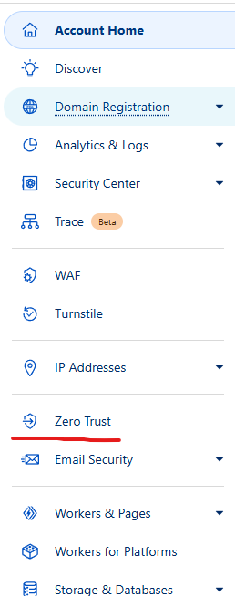

#  Home-Lab Zero Trust Setup

I will be deploying Cloud Flares Zero Trust free tier solution to my Home-lab in a series of demonstrations to display a simple Zero trust configuration as well as help quantify the differences between Zero Trust architecture vs traditional network architectures. These Demonstrations will be split up in the different Pillars that make up Zero-Trust networking.

The first step which is important for publishing DNS records that point public hostnames to internal applications is to have a public domain and set Cloudflare are your DNS server through NS records.

There is a step by step process that guides you through theses steps as you register your domain into Cloud Flare. Once completed you can see the NS servers under your domain > DNS > Records.

Once connected its time to deploy the "Cloudflared" tunnel which is your application connector. This will be the broker for connections coming from public hostnames that you publish or routes defined to internal resources.

To deploy this go to the Zero Trust portal in Cloudflare under "Zero Trust"

Next go to Networks > Tunnels > Create a tunnel

Next you Select CloudFlared and name your Tunnel

We will now see the installation methods. You can choose to install the Cloudflared connector on any OS you would like.

You then copy and paste the command shown which runs the installer with your specific Token to tie it to your Cloudflare tenant.

Your tunnel status should be showing HEALTHY.

To enable network access through the Cloudflared tunnel using the WARP client you will create a Route as well as define the split tunnel configuration for the client. Let's configure that now.

Create route:

Next we will edit the WARP device settings. Go to Setting > WARP Client > Device Settings > Profile Settings then click on your profile. You can either modify the default or create a new one.

Go to Split-Tunnel and set to include and hit Manage. Under there you will define the networks that should flow through the WARP client.

Now that we have tunnel connectivity let's configure work on the first pillar of Zero Trust.

# Identity

By default it will use your Cloudflare account as well as a one time pin to authenticate your web portal access. Let's configure secondary IDP through Github but this can apply through any other OAuth provider.

Follow the needed steps to connect the specific IDP. for OAuth its mainly a client or application ID followed by a client or application secret after inputting the homepage and callback page.

We can now see Github is in our authentication methods.

Github has 2 factor integrated into the login but if 2 factor is not configured through your IDP of choice this is a baseline configuration for todays standard. We need to ensure they not only have a user and password but a secondary code generated by SMS/Authenticator app or FIDO key.

Next let's look at Device Security another key pillar to our Zero Trust architecture.

# Device Security

Device Security has many different variables, from EDR to patching but in this we are going to be looking at how Device Security is integrated into the Network Security pillar using Device Posture checks. This is part of endpoint continous assessment. if that status changes we can adjust how the network treats that device and its network flows.

To configure Device Posture checks we are going to go to Settings > Warp Client > Device Posture. Then Add New

Let's start with a simple Firewall check and enable it to validate whether the firewall on the endpoint is enabled. 

We will also configure a file check.

Now with both posture checks in place let's go onto the client and validate the postures statuses.

As we can see the device posture checks have applied and are both in a true state indicating the file exists and the Firewall is enabled.

# Deploying an application through CloudFlare

Next lets deploy an application through Cloudflare.

Go to Access then applications. Create a new application and select Private Network.

Configure the name, in this case we will do access into the firewall.

Configure the Private IP or Hostname and port that its reachable by and configure the policy.

Next we are configuring a policy which will reference the Device-Posture checks.

Next we are going to try and access the firewall through the client. 

Success. 

Now let's delete the testing file and check the device posture again.

As we can see the posture has changed. By default for Cloudflare Device Posture is evaluated at the start of the session creation. We will create a new session to the firewall and see if the traffic is passed. (Changes to Session lifespan will be needed depending on how quickly you want the network to react to the device posture change. Device Posture on Cloudflare is evaluated every 5 minutes)

Let's add the file back and check the logs once again.

Success. This displays the use of continuous assessment to ensure that device are compliant while accessing resources. 

In the Next Demonstration (Zero-Trust Network-Security) we will look at key features of policy enforcement and traffic inspection that make up the Network security pillar of Zero Trust.