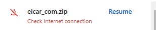

# Network Security

Now that we went over Identity and Device Security in the prior demonstration we will now look at the Network Security Pillar and how this integrates into Zero-Trust. 

In this Demonstration we will dive into the traffic being sent to and from the endpoint as well as the data within the payload. We will be utilizing TLS decryption to gain visibility and apply policy enforcement on your endpoints.

To configure TLS decryption on the WARP client go to Settings > Network > TLS Decryption and enable TLS decryption. Following this we will have to ensure that the CA certificate from cloudflare is installed on each endpoint. This can be set to be done automatically under Settings > WARP Client > Global Settings > Install CA Certificate

  
  

# TLS Decryption

We are going to be displaying the use of TLS Decryption also known as SSL inspection on some internet based traffic. Most modern sites will utilize HTTPS traffic which encrypts the payload data using TLS. This increases security and confidentiality between the end user and the site. From a business perspective this has become a modern issue as without TLS Decryption we lose visibility of what is being sent between the endpoint and the site and subsequently we can't secure what we can't see.

This is where TLS Decryption come into play. We are purposefully going to middle man the traffic of the end users allowing us to see within the payload and see what is being delivered to the end user. This is done by installing a trusted certificate on the endpoints once a connection request comes to the firewall it will present its internal certificate instead of the site certificate. The firewall then establishes a connection with the site and now that TLS is terminated on both ends the firewall can decrypt the site traffic and then re-encrypt the traffic forwarding it to the endpoint after inspection.

Let's start with downloading the file without TLS decryption.

As we can see the file was downloaded but then found by Defender the EDR solution on the endpoint. We may think that Defender found the file and that this is great but remember that Defender may not have the signatures in its Database for this specific malicious code downloaded from our users. By the time the file is on the endpoint it's too late, we want to stop the file in transit which guarantees that the file never reached the endpoint allowing us to eliminate investigations about possible lateral movement or determining whether the payload activated or not. This is a key benefit to TLS decryption is stopping the payload in transit before it hits your network and Endpoint.

Before we can test let's ensure to enable AV scanning on our WARP client in cloudflare. To do so go to Settings > Network > AV Inspection. Enable scan file upload and downloads.

Let's re-run a test on the same EICAR file.

  

As we can see the EICAR file was blocked by Cloudflare and in the browser the file never downloaded. This means we can say with 100% confidence the file never made it to the workstation so no further investigation is needed to determine payload execution or lateral movement.

We can see the related block on Cloudflare's portal which could alert administrators of this kind of incident to follow up with the user and enforce business policy or training to help secure their workforce.

One common question that may come up is if the defender database doesn't have the hash for this bad file then how will your firewall product have it. There are no guarantees but due to the amount of traffic ingested by your cloud firewall vendor or on prem firewall vendor the time from when a zero day is seen and found to the time enforcement happens is almost instant. If we think of Cloud firewall vendors like Cloudflare,Zscaler once a zero day is known they can propagate a block for this file as well as associated URLs throughout their security gateways almost instantly and since your device consistently has to pass through this gateway for its internet traffic you get almost instant enforcement. Your EDR on the other hand you have to wait for a device check in to get updated signatures as well URL or IP based filtering is unavailable and the key is to stop it before it hits your network.

Staying within the network security pillar let's demonstrate another use case for TLS Decryption.

# Data Loss Prevention (DLP)

Data Loss Prevention is exactly as it sounds. Its intent is by using TLS decryption we can see the data within the payload and can match this to known information databases like Credit Card information and Social Security Numbers and block traffic that matches or alert an administrator or compliance department.

By utilizing DLP we can ensure that data that is meant to remain private or within the business is not leaked to unwanted locations whether that be cloud storage, sending to third parties or even putting that data into an AI tool like chatgpt, copilot etc.

First let's test sending a credit card number within any inspection.

As we can see we can send a Credit Card number to a site for example filling in a form and there is nothing stopping that data from leaving the network. Let's implement DLP to secure our data leaving the network.

Go to Zero-Trust > DLP > DLP Policies > Open the predefined Social Security and Insurance Policy.

  

We will enable the status of all the following social security numbers but this may not be needed if you are not managing Data from certain locations. Additionally we set the match count to be greater than 0 so it will match any traffic which contains at least one social security number or more and the confidence level to Medium. This will need to be adjusted based on false positive rate.

Next we go to Gateway > HTTP and create a new Firewall Policy.

In this policy we will define the traffic selector as DLP profile and select our Social security DLP profile. Action is set the Block.

Now that DLP is configured lets attempt to re-send the private information and see if it is blocked.

As we can see the post was blocked as it matched the DLP profile we configured saving our confidential data from accidentally or intentionally leaving the network.

We can see the related log in the Cloudflare portal to which we could create an alert or action item to a compliance department within the business.
