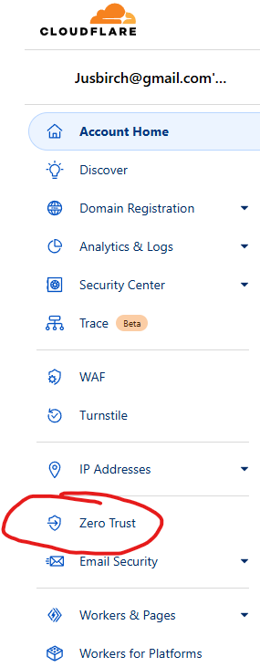

#  Home-Lab Zero Trust Setup

I will be deploying Cloud Flares Zero Trust free tier solution to my homelab to display a simple Zero trust configuration as well as help quantify the differences between Zero Trust architecture vs traditional network architectures.

The first step which is important for publishing DNS records that point public hostnames to internal applications is to have a public domain and set cloudflare are your DNS server through NS records.

There is a step by step process that guides you through theses steps as you register your domain into Cloud Flare. Once completed you can see the NS servers under your domain > DNS > Records.

Once connected its time to deploy the "cloudflared" tunnel which is your application connector. This will be the broker for connections coming from public hostnames that you publish or routes defined to internal resources.

To deploy this go to the Zero Trust portal in cloudflare under "Zero Trust"

Next go to Networks > Tunnels > Create a tunnel

Next you Select CloudFlared and Name your Tunnel

We will now see the installation methods. You can choose to install the cloudflared connector on any OS you would like.

You then copy and paste the command shown which runs the installer with your specific Token to tie it to your Cloudflare tenant.

Your tunnel status should be showing HEALTHY.

Now that we have tunnel connectivity let's configure work on the first pillar of Zero Trust.

# Identity

By default it will use your cloudflare account as well as a one time pin to authenticate your web portal access. Let's configure secondary IDP through Github but this can apply through any other OAuth provider.

