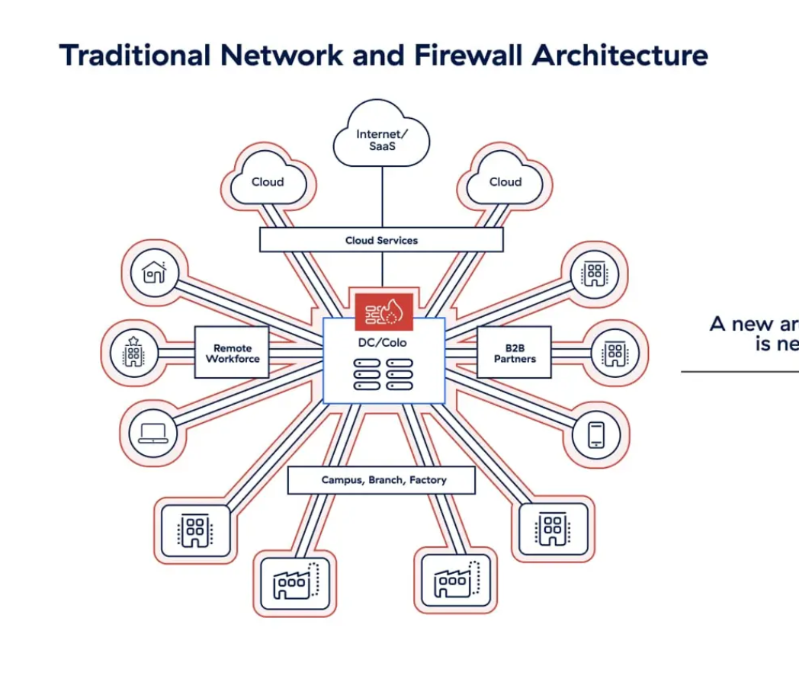
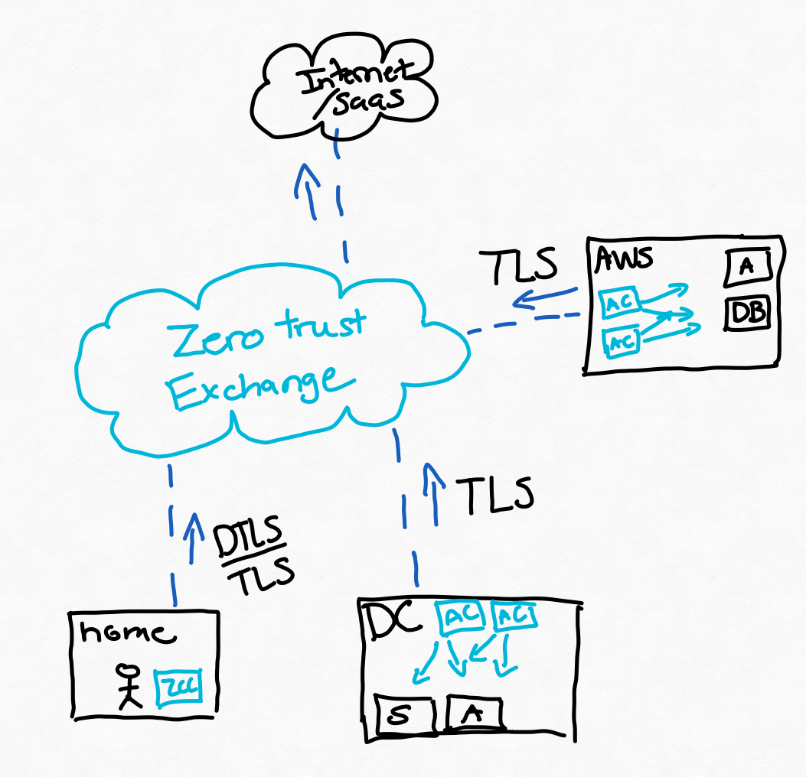
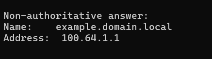

#  Zscaler Private Access vs VPN

In this lab we are going to be talking about key differentiators between Zscaler Private Access and traditional VPN's. We are going to dive deeper into key components that stand out to help overall security, exposure and strenghten our audit posture.

# What is Zscaler Private Access

I will keep this short and sweet. Zscaler Private Access is a Zero trust Network Access platform which ties together both on premise and off premise application level access while evaluating additional contexts and Identity.

# Architecture

Let's briefly touch on the architecture that is foundational to Zscaler Platform and how we provide global application level access both securely and with a great user experience.

First let's talk about our traditional network. In this Architecture we find ourselves with multiple branch sites, an HQ and maybe some Iaas or Paas services as cloud workloads. Each interconnect between these resources require IPsec tunnel. Routed networks and Potentially inbound services or exposed public IP's. For us to support remote users we also add SSL or Ipsec Client VPN's.

This architecture brings a lot of pain points forward that we can look to solve.

1: Public Address exposure  
2: Implicit Network trust  
3: Complex Policy and Network Administration  

How can we improve these pain point and what is the result from going through this change. Let's get into the technical nitty gritty for each and expose what true Zero Trust enlightenment brings.

# Public Address exposure

We have all been there. Cyber Insurance, External Pentest and Audit reports or even newly disclosed CVE's. A fundamental component to the network is your border. It determines how visible you are to the internet, how risky your business is classified by what resources are standing behind those public IP's and even what CVE's may be waiting to be exploited on your yearly pentest or Cyber Scan.

Because of the legacy network architecture we are forced to have exposed endpoints at each location. Firewall at the Branch and DC, NVA in the cloud or even an endpoint IP right off Azure. How can we do better, how can we reduce partially or even completely remove our public footprint? Hint, its Zscaler.

If we look at the new Architecture above we have a key distinction. Remote users are connecting to the Zscaler POP through a DTLS/TLS connection but our deployed app connectors in the cloud and in the DC are NOT listening inbound for a TLS connection. There is no DNAT or exposed IP because connectivity is stitched at the Zscaler POP, app connectors also flow outbound over TLS to the Zscaler POP to relay information back to the user.

By removing VPN concentrators we no longer have public address exposure at the DC, Cloud or at the branch for end user connectivity. The application is requested by the device and the Zero Trust Exchange determines which app connector can reach the application to complete the connection and is then stitches to the Datacenter that the user is connected through.

# Implicit Network trust

Implicit network trust is a fundamental flaw in today's network access structure. This made sense when there were clear definitions of the walls surrounding the companies applications but falls short when trying to build a zero trust architecture. If we think about how vlan segmentation was setup just a few years ago we always talked about user to server or user to dmz level policies.

In today's configurations is to open. We can no longer trust that a device on the network is not a threat. We need additional context and controls, this is where ZPA steps in.

First, we pull in device context. Identity, Posture, location, device type. All of these additional pieces of context help to determine the state that we want the user and device to be in when accessing our applications.

Zscaler Private Access facilitates access direct to applications and not network level access. This obfuscation of the underlying network hinders the ability to move laterally during the discovery state of the killchain. Let's talk about the techniques behind this.

1: Obfuscation of DNS resolution to the client.

Zscaler Private Access employs DNS obfuscation at the time of resolution when we have a defined application that the user can access. The DNS name will always resolve into the 100.64.0.0/16 synthetic host pool range and eliminates the ability for a malicious attacker or program to discover the underlying server network through the DNS response.

This added control removes the network from the equation and ensures we are only connecting users to applications. 

2: Removing Inter-VLAN Connectivity

Now that we have the Zscaler architecture in place we no longer require the user networks to connect to the servers. We use the Zero Trust Exchange and the app connector to facilitate user to application access. We can now begin to disconnect the traditional implicit trust network model for our user networks.

There is a key advantage when we do this. User networks used to be a liability, the potential that someone could connect to your corporate SSID or User network and move laterally throughout the network. We can now remove policies that facilitate connectivity for user vlan's to server vlan's. What happens when an attacker physically attempts to breach by using a stolen PSK. They can access the internet, maybe check out a facebook post or two but they can't directly reach the servers that they want.

This reduces our cost and dependencies on NAC solutions and for certain businesses eliminates the requirement for this at all.

3: Imploying additional context

Access is no longer based on if the user is in the office, so our policies and network access can no longer follow that model. Being able to employ policies that follow the user and their identity are both critical to removing implicit network trust but also rolls into easing administration and policy control which we will get into later.

# Reference Document List

https://www.zscaler.com/products-and-solutions/zero-trust-exchange-zte#assess-risk
